# DIRE DAWA UNIVERSITY
### INSTITUTE OF TECHNOLOGY
### SCHOOL OF COMPUTING
### DEPARTMENT OF SOFTWARE ENGINEERING

---

# SOFTWARE REQUIREMENTS SPECIFICATION AND SYSTEM DESIGN (SRS & SDD)
## FOR
## MOVIE WATCHLIST WEB & CINEMA MEDIA STREAMING PLATFORM

**Course:** Software Requirements Engineering & Enterprise System Architecture  
**Location:** Dire Dawa, Ethiopia  
**Target Platform:** Linux / Docker Compose / Cross-Platform JVM  
**Date:** October 2026  
**Document Status:** Baselined / Enterprise Academic Standard  

---

## Table of Contents
- [List of Figures](#list-of-figures)
- [List of Tables](#list-of-tables)
- [List of Acronyms](#list-of-acronyms)
- [Acknowledgement](#acknowledgement)
- [CHAPTER ONE: INTRODUCTION](#chapter-one-introduction)
  - [1.1 Background of the Study](#11-background-of-the-study)
  - [1.2 Problem Statement](#12-problem-statement)
  - [1.3 Objectives of the Study](#13-objectives-of-the-study)
    - [1.3.1 General Objective](#131-general-objective)
    - [1.3.2 Specific Objectives](#132-specific-objectives)
  - [1.4 Scope of the Study](#14-scope-of-the-study)
    - [1.4.1 In-Scope](#141-in-scope)
    - [1.4.2 Out-of-Scope](#142-out-of-scope)
  - [1.5 Significance of the Study](#15-significance-of-the-study)
    - [1.5.1 Strategic Importance to Personal & Home Media Ecosystems](#151-strategic-importance-to-personal--home-media-ecosystems)
    - [1.5.2 Operational & Resource Efficiency](#152-operational--resource-efficiency)
    - [1.5.3 Data Integrity and Offline Trustworthiness](#153-data-integrity-and-offline-trustworthiness)
    - [1.5.4 Cost of Inaction and Economic Feasibility](#154-cost-of-inaction-and-economic-feasibility)
  - [1.6 Project Methodology Overview](#16-project-methodology-overview)
  - [1.7 Organization of the Document](#17-organization-of-the-document)
  - [1.8 Budget and Development Plan](#18-budget-and-development-plan)
- [CHAPTER TWO: EXISTING SYSTEM ANALYSIS](#chapter-two-existing-system-analysis)
  - [2.1 Existing System Analysis](#21-existing-system-analysis)
    - [2.1.1 Description of the Reference & Legacy Systems](#211-description-of-the-reference--legacy-systems)
    - [2.1.2 Limitations of the Existing Approaches](#212-limitations-of-the-existing-approaches)
  - [2.2 Requirements Engineering Process Models](#22-requirements-engineering-process-models)
  - [2.3 Requirements Elicitation Techniques](#23-requirements-elicitation-techniques)
  - [2.4 Requirements Analysis and Negotiation](#24-requirements-analysis-and-negotiation)
  - [2.5 Requirements Specification Standards (IEEE 830 / ISO 29148)](#25-requirements-specification-standards-ieee-830--iso-29148)
  - [2.6 Requirements Validation and Verification](#26-requirements-validation-and-verification)
  - [2.7 Challenges in Software Requirements Engineering](#27-challenges-in-software-requirements-engineering)
  - [2.8 Review of Related Systems (Plex, Jellyfin, Kodi, Letterboxd, Trakt)](#28-review-of-related-systems)
- [CHAPTER THREE: SYSTEM ANALYSIS](#chapter-three-system-analysis)
  - [3.1 Overview of Software Requirements Engineering](#31-overview-of-software-requirements-engineering)
  - [3.2 Proposed System Overview](#32-proposed-system-overview)
  - [3.3 Stakeholder Identification and Analysis](#33-stakeholder-identification-and-analysis)
  - [3.4 Business Process Analysis (BPA)](#34-business-process-analysis-bpa)
  - [3.5 Feasibility Study](#35-feasibility-study)
    - [3.5.1 Technical Feasibility](#351-technical-feasibility)
    - [3.5.2 Economic Feasibility](#352-economic-feasibility)
    - [3.5.3 Operational Feasibility](#353-operational-feasibility)
  - [3.6 Requirements Elicitation Techniques Applied](#36-requirements-elicitation-techniques-applied)
  - [3.7 System Requirements](#37-system-requirements)
    - [3.7.1 Functional Requirements (FR)](#371-functional-requirements-fr)
    - [3.7.2 Non-Functional Requirements (NFR)](#372-non-functional-requirements-nfr)
  - [3.8 Assumptions and Constraints](#38-assumptions-and-constraints)
  - [3.9 Requirements Prioritization (MoSCoW Matrix)](#39-requirements-prioritization-moscow-matrix)
  - [3.10 Requirements Traceability Approach](#310-requirements-traceability-approach)
- [CHAPTER FOUR: SYSTEM MODELING AND DESIGN](#chapter-four-system-modeling-and-design)
  - [4.1 System Architecture Overview (3-Tier Layered Design)](#41-system-architecture-overview)
  - [4.2 Use Case Modeling & Actor Descriptions](#42-use-case-modeling--actor-descriptions)
  - [4.3 Activity Diagrams](#43-activity-diagrams)
  - [4.4 Sequence Diagrams](#44-sequence-diagrams)
  - [4.5 Class Diagram & Structural Domain Model](#45-class-diagram--structural-domain-model)
  - [4.6 Data Flow Diagrams (DFDs)](#46-data-flow-diagrams-dfds)
  - [4.7 Entity-Relationship Diagram (ERD) & Cloud Schema](#47-entity-relationship-diagram-erd--cloud-schema)
  - [4.8 User Interface Requirements](#48-user-interface-requirements)
  - [4.9 Logical Database Requirements](#49-logical-database-requirements)
  - [4.10 Quality Attributes (ISO/IEC 25010)](#410-quality-attributes-isoiec-25010)
  - [4.11 Requirements Traceability Matrix (RTM)](#411-requirements-traceability-matrix-rtm)
- [CHAPTER FIVE: CONCLUSION AND RECOMMENDATIONS](#chapter-five-conclusion-and-recommendations)
  - [5.1 Conclusion](#51-conclusion)
  - [5.2 Recommendations](#52-recommendations)
- [References](#references)

---

## List of Figures
- **Figure 4.1.1**: 3-Tier Layered System Architecture
- **Figure 4.2.1**: System Use Case Diagram
- **Figure 4.3.1**: Activity Diagram: Media Library Scan & Auto-Matching
- **Figure 4.3.2**: Activity Diagram: Subtitle Extraction & Cinema Playback
- **Figure 4.4.1**: Sequence Diagram: System Initialization & Authentication
- **Figure 4.4.2**: Sequence Diagram: Persistent Session & Remember-Me Token Resolution
- **Figure 4.4.3**: Sequence Diagram: TMDB Discovery & Multi-Parametric Search
- **Figure 4.4.4**: Sequence Diagram: Watchlist & Watched Rating Submission
- **Figure 4.4.5**: Sequence Diagram: Filesystem Traversal & Regex Hierarchy Parsing
- **Figure 4.4.6**: Sequence Diagram: TMDB Fuzzy Matching & Local Poster Caching
- **Figure 4.4.7**: Sequence Diagram: HTTP 206 Byte-Range Video Streaming
- **Figure 4.4.8**: Sequence Diagram: On-the-Fly FFmpeg WebVTT Subtitle Extraction
- **Figure 4.4.9**: Sequence Diagram: Cloud Firestore Two-Way Sync Reconciliation
- **Figure 4.5.1**: Complete System Class Diagram
- **Figure 4.6.1**: DFD Level 0: Context Diagram
- **Figure 4.6.2**: DFD Level 1: Main Process Decomposition
- **Figure 4.6.3**: DFD Level 2: Critical Process Breakdown (Streaming & Subtitle Engine)
- **Figure 4.7.1**: Entity-Relationship Diagram (ERD)

---

## List of Tables
- **Table 1.1**: Human Resource & Team Role Allocation
- **Table 1.2**: Project Development Timeline & Milestones
- **Table 1.3**: Human Resource Cost Breakdown (ETB)
- **Table 1.4**: Software & Tooling Cost Breakdown (ETB)
- **Table 1.5**: Infrastructure, Hosting & Deployment Cost Breakdown (ETB)
- **Table 1.6**: Documentation & Training Cost Allocation (ETB)
- **Table 1.7**: Contingency & Initial Maintenance Budget (ETB)
- **Table 1.8**: Consolidated Project Budget Summary (ETB)
- **Table 3.1**: Stakeholder Identification & Responsibilities Matrix
- **Table 3.2**: MoSCoW Requirements Prioritization Matrix
- **Table 4.1**: Logical Database Table Definitions & Key Constraints
- **Table 4.2**: Requirements Traceability Matrix (RTM)

---

## List of Acronyms
| Acronym | Full Meaning |
| :--- | :--- |
| **SRS** | Software Requirements Specification |
| **SDD** | Software Design Document |
| **IEEE** | Institute of Electrical and Electronics Engineers |
| **ISO** | International Organization for Standardization |
| **IEC** | International Electrotechnical Commission |
| **TMDB** | The Movie Database |
| **PWA** | Progressive Web Application |
| **RDBMS** | Relational Database Management System |
| **JPA** | Java Persistence API |
| **MVC** | Model-View-Controller |
| **REST** | Representational State Transfer |
| **VTT** | Web Video Text Tracks |
| **SRT** | SubRip Subtitle Format |
| **AES** | Advanced Encryption Standard |
| **GCM** | Galois/Counter Mode |
| **ETB** | Ethiopian Birr |
| **DFD** | Data Flow Diagram |
| **ERD** | Entity Relationship Diagram |
| **RTM** | Requirements Traceability Matrix |
| **RBAC** | Role-Based Access Control |
| **JVM** | Java Virtual Machine |
| **RFC** | Request for Comments |
| **UI/UX** | User Interface / User Experience |

---

## Acknowledgement
The completion of this comprehensive engineering specification and architecture document would not have been possible without the academic rigor, foundational principles, and institutional environment fostered by **Dire Dawa University, Institute of Technology, School of Computing, Department of Software Engineering**.

Sincere appreciation is extended to academic instructors and software engineering mentors whose continuous insistence on formal specifications, empirical feasibility, and verifiable modeling shaped the methodology of this study. Recognition is also due to open-source media engineering communities whose standards in multimedia streaming (RFC 7233, W3C WebVTT, and FFmpeg) enabled the design of high-performance, low-resource software architectures.

---

# CHAPTER ONE: INTRODUCTION

## 1.1 Background of the Study
The rapid proliferation of digital multimedia has fundamentally transformed how individuals and households consume, organize, and track video entertainment. Contemporary media consumers frequently manage collections distributed across external physical drives, local network storage (NAS), and global cloud streaming platforms. However, this dispersion has produced severe fragmentation: users struggle to maintain a unified history of watched titles, manage prospective watchlists, discover upcoming releases, and stream high-definition local media without relying on expensive, resource-heavy transcoding servers.

Historically, media management has been polarized into two extremes:
1. **Commercial Cloud-Only Catalog Trackers (e.g., Letterboxd, IMDb, Trakt):** These services provide rich social features and catalog exploration but possess zero awareness of a user's private, locally stored video files. They cannot play local files or operate without continuous high-speed internet.
2. **Heavyweight Local Media Servers (e.g., Plex, Emby, Jellyfin):** These platforms index local hard drives effectively but demand high-performance CPU/GPU hardware to transcode video streams in real time. On basic-tier personal computers or modest home servers, CPU spikes cause buffering, high power draw, and thermal throttling. Furthermore, their cross-device list sync is locked into complex vendor accounts or self-hosted port forwarding.

The **Movie Watchlist Web Platform** is an enterprise-grade, lightweight web system that bridges this gap. Originating as an evolution from a standalone Flutter client, the Java/Spring Boot web rebuild provides an integrated, dark-and-red cinema web interface. It combines server-side TMDB discovery, cloud synchronization via Google Cloud Firestore, an offline-first PostgreSQL/H2 caching architecture, an automated filesystem scanner, and an RFC 7233 compliant zero-copy byte-range video streaming engine equipped with dynamic FFmpeg WebVTT subtitle extraction.

## 1.2 Problem Statement
Despite the availability of media tracking apps and home servers, users operating on standard or entry-level computing hardware face persistent technical and operational bottlenecks:

1. **Hardware Inefficiency and Transcoding Overhead:** Mainstream media server solutions assume server-grade multi-core CPUs or dedicated hardware encoders (NVENC/QuickSync). When deployed on budget dual-core laptops or basic desktops, real-time re-encoding of 1080p video causes 100% CPU saturation, UI freeze, and stream stuttering.
2. **Data Fragmentation and Vendor Lock-In:** Watchlist entries, custom ratings, and watched history are frequently siloed in proprietary databases. When connectivity drops, users lose access to their personal libraries. Conversely, local changes made while offline are often overwritten or lost upon reconnecting.
3. **Complex Subtitle and Container Handling:** Modern media collections contain diverse video containers (`.mkv`, `.mp4`) housing embedded subtitle streams in raw text formats (SubRip, ASS, Mov_Text) or separate sidecar files (`.srt`, `.vtt`). HTML5 web video players cannot parse embedded MKV text tracks natively without on-the-fly stream extraction, forcing users to manually download external subtitle files.
4. **Lack of Portable, Zero-Install Deployment:** Users require a system that can run either as a self-hosted Docker Compose stack with PostgreSQL or as a single-click, zero-configuration portable runner (`preview` / `portable` H2 profile) requiring no database installation.

Without a centralized, low-overhead, offline-resilient solution, users are caught between high hardware costs and fragmented media organization.

## 1.3 Objectives of the Study

### 1.3.1 General Objective
The primary objective of this project is to analyze, specify, design, and implement an autonomous, cloud-synchronized, low-resource **Movie Watchlist Web and Cinema Streaming Platform** that unifies global catalog exploration, personal list tracking, local media scanning, and hardware-efficient web video streaming with automated subtitle extraction.

### 1.3.2 Specific Objectives
1. **Analyze Existing Media Platforms:** Review the operational limitations of mobile-only tracking applications and heavy transcoding servers (Plex, Jellyfin, Kodi).
2. **Formulate Standard Requirements (IEEE 830):** Produce complete, verifiable functional and non-functional requirements covering security, streaming, and synchronization.
3. **Design a 3-Tier Layered Architecture:** Develop an MVC architecture decoupling presentation, domain logic, relational persistence, and external service gateways (TMDB, Firebase, FFmpeg).
4. **Implement Zero-Copy Video Streaming:** Develop an HTTP 206 Partial Content byte-range streaming pipeline using Spring's `ResourceRegion` that eliminates CPU transcoding bottlenecks on basic host hardware.
5. **Construct an On-the-Fly Subtitle Extraction Subsystem:** Implement non-blocking subprocess orchestration with `ffprobe` and `ffmpeg` to extract embedded MKV/MP4 text tracks into compliant WebVTT streams.
6. **Implement Dual-Tier Offline-Resilient Sync:** Engineer a bidirectional sync engine between local PostgreSQL/H2 relational tables and Google Cloud Firestore using client-side Firebase Identity authentication.
7. **Ensure Scalable Deployment:** Package the application using multi-stage Docker Compose, Flyway migration scripts (`V1`–`V8`), and standalone Spring profiles (`preview`, `portable`).

## 1.4 Scope of the Study

### 1.4.1 In-Scope
The project encompasses the following functional and technical domains:
- **User Authentication & Identity Federation:** Local BCrypt password authentication, optional Firebase Authentication bridging, and persistent "Remember-Me" session tokens using AES-GCM-256 encrypted refresh keys (`V6`, `V7` migrations).
- **Global Catalog & TMDB Integration:** Server-side TMDB v3 API consumption, multi-rail carousels (Trending, Popular, Top Rated, Upcoming), genre filtering, release year filtering, and full title detail views with trailer embedding.
- **Watchlist & Watched History Tracking:** 1-to-5 star ratings, watched timestamps, personal watchlist aggregation, and genre-based dynamic recommendations.
- **Dual-Tier Cloud Synchronization:** Real-time reconciliation between local PostgreSQL/H2 tables and Cloud Firestore collections (`/users/{uid}/watchlist`, `/users/{uid}/watched`) with offline fallback.
- **Local Media Indexing & Organization:** Background directory traversal of user-configured scan roots (`media_scan_root`), regex-based episode/season hierarchy extraction, and Levenshtein fuzzy matching ($\ge 0.55$ threshold) against TMDB titles.
- **Local Poster Image Caching:** Binary `BYTEA` storage of TMDB poster assets in PostgreSQL (`local_media_poster_cache`) to guarantee offline UI rendering.
- **Cinema Web Video Player:** In-browser HTML5 player featuring RFC 7233 range streaming, 10s skip controls, resume position tracking (`localStorage`), keyboard shortcuts, and next-episode autoplay.
- **Dynamic Subtitle Pipeline:** Automated sidecar `.srt` to `.vtt` formatting and real-time `ffmpeg` stream extraction of embedded container tracks.
- **Containerization & Deployment:** Docker Compose multi-service definitions, Flyway schema migrations, and Linux desktop launcher integration.

### 1.4.2 Out-of-Scope
The following areas are explicitly excluded:
- **Real-Time Video Transcoding:** Transcoding video codecs (e.g., converting legacy MPEG-2/DivX to H.264 on the fly) is excluded to preserve low CPU utilization.
- **Native Mobile App Compilation:** Native Android/iOS builds are excluded; mobile access is delivered through responsive web views and PWA service workers.
- **Commercial DRM Decryption:** Decryption of protected Widevine, FairPlay, or PlayReady streams is outside the system scope.
- **Live Television & IPTV Ingestion:** The system focuses exclusively on on-demand personal video files and catalog tracking.

## 1.5 Significance of the Study

### 1.5.1 Strategic Importance to Personal & Home Media Ecosystems
As digital streaming fractures across dozens of paid platforms, consumers increasingly store physical and digital backups of their media. This study provides an open, extensible, self-hosted platform that gives users total data sovereignty over their watching habits, ratings, and media files without reliance on third-party commercial ecosystems.

### 1.5.2 Operational & Resource Efficiency
Unlike commercial media servers that demand continuous GPU/CPU power for transcoding, the zero-copy byte-range streaming engine designed in this study operates with near-zero CPU overhead. This allows households to repurpose standard desktop computers, older laptops, or low-power micro-PCs as full-featured cinema servers.

### 1.5.3 Data Integrity and Offline Trustworthiness
By maintaining a dual-tier persistence model (PostgreSQL relational caching + Cloud Firestore sync), the system guarantees that user records remain accessible during internet outages. Local modifications are securely staged and automatically reconciled upon reconnection, eliminating data loss.

### 1.5.4 Cost of Inaction and Economic Feasibility
Operating without an integrated, lightweight system imposes tangible recurring costs:
- **Hardware Energy Costs:** Running a conventional 150W transcoding server 24/7 costs approximately $150–$250 USD annually in electricity alone. A lightweight Spring Boot byte-range server running on a 15W mini-PC reduces power consumption by over 90%.
- **Subscription Redundancy:** Commercial catalog tracking and metadata scrapers cost between $30 and $60 USD annually per user.
- **Labor & Time Overhead:** Manually searching for external subtitles, converting `.srt` files, renaming downloaded episodes, and tracking watched episodes in separate spreadsheets wastes an estimated 80 hours per user annually.

In the Ethiopian ICT context, commercial media servers and cloud storage subscriptions represent unsustainable foreign-currency expenditures. Developing an autonomous, open-source Java/Spring Boot solution eliminates foreign subscription dependencies and maximizes local hardware reuse.

## 1.6 Project Methodology Overview
The project adopted a **Hybrid Software Development Life Cycle (SDLC)**, merging the disciplined documentation and requirements traceability of the Waterfall model with the rapid prototyping and iterative refinement of Agile development:

```
+-------------------------------------------------------------------------+
| Phase 1: Requirements Engineering (Elicitation, IEEE 830, Feasibility)  |
+------------------------------------+------------------------------------+
                                     |
+------------------------------------v------------------------------------+
| Phase 2: Architectural & Relational Modeling (MVC, ERD, DFD, UML)       |
+------------------------------------+------------------------------------+
                                     |
+------------------------------------v------------------------------------+
| Phase 3: Iterative Implementation (Spring Boot 4, Flyway, FFmpeg)       |
+------------------------------------+------------------------------------+
                                     |
+------------------------------------v------------------------------------+
| Phase 4: Verification, Security Testing & Docker Deployment             |
+-------------------------------------------------------------------------+
```

## 1.7 Organization of the Document
- **Chapter One:** Introduction, background, problem statement, objectives, scope, significance, methodology, budget, and development plan.
- **Chapter Two:** Existing system analysis, review of related media servers, and requirements engineering process models.
- **Chapter Three:** System analysis, stakeholder identification, business process flows, technical/economic/operational feasibility, and formal FR/NFR specifications.
- **Chapter Four:** System modeling and design, including 3-tier architecture, use cases, activity flows, 9 detailed sequence diagrams, class models, DFDs, ERDs, UI requirements, and the Requirements Traceability Matrix (RTM).
- **Chapter Five:** Conclusion, technical achievements, operational recommendations, and future enhancements.

## 1.8 Budget and Development Plan
The development plan reflects realistic public-sector and institutional software engineering standards in Ethiopia, leveraging local engineering talent, open-source platforms, and existing hardware infrastructure.

### Table 1.1: Project Human Resource Allocation
| Role / Responsibility | Team Size | Core Responsibilities | Involvement | Duration |
| :--- | :---: | :--- | :---: | :---: |
| **Project Supervisor / Architect** | 1 | Architecture oversight, security design, code review | Part-time | 6 Months |
| **Lead Backend Engineer** | 1 | Spring Boot services, Flyway migrations, FFmpeg piping | Full-time | 6 Months |
| **Frontend / UI Engineer** | 1 | Thymeleaf templates, Cinema Player UI, CSS/PWA design | Full-time | 5 Months |
| **Database Administrator** | 1 | PostgreSQL optimization, indexing, H2 compatibility | Part-time | 3 Months |
| **QA & Security Test Engineer** | 1 | Range header verification, path traversal testing | Part-time | 3 Months |
| **DevOps / Deployment Engineer** | 1 | Docker Compose, systemd launcher, Linux packaging | Part-time | 2 Months |
| **Technical Documentation Specialist** | 1 | IEEE SRS preparation, architecture diagrams, manuals | Part-time | 2 Months |

### Table 1.2: Development Timeline & Milestones
| Milestone Phase | Focus Activities | Duration | Target Deliverable |
| :--- | :--- | :---: | :--- |
| **Phase 1: Inception & SRE** | Requirements elicitation, feasibility, IEEE SRS drafting | Month 1–2 | Baselined SRS & Architecture |
| **Phase 2: Core Engine** | Spring Security, JPA entities, Flyway V1–V5, TMDB client | Month 3–4 | Working Backend & DB Schema |
| **Phase 3: Media & Player** | Scanner, FFmpeg/ffprobe subtitle pipeline, range streaming | Month 5 | Cinema Player & Library Scanner |
| **Phase 4: Cloud Sync & PWA** | Firestore sync, Remember-Me V7, Docker packaging, testing | Month 6 | Production Container Stack |

### Table 1.3: Human Resource Cost Breakdown (ETB)
| Professional Role | Monthly Rate (ETB) | Duration | Total Cost (ETB) |
| :--- | :---: | :---: | :---: |
| Project Supervisor / Lead Architect | 40,000 | 6 Months | 240,000 |
| Lead Backend Engineer (Spring Boot/Java) | 45,000 | 6 Months | 270,000 |
| Frontend Engineer (Thymeleaf/CSS/PWA) | 35,000 | 5 Months | 175,000 |
| Database Administrator (PostgreSQL/Flyway) | 30,000 | 3 Months | 90,000 |
| QA & Test Automation Specialist | 25,000 | 3 Months | 75,000 |
| DevOps & Infrastructure Engineer | 35,000 | 2 Months | 70,000 |
| Technical Writer & Document Specialist | 20,000 | 2 Months | 40,000 |
| **Total Human Resource Cost** | | | **960,000 ETB** |

### Table 1.4: Software & Tooling Cost Breakdown (ETB)
| Item Description | Justification / Type | Cost (ETB) |
| :--- | :--- | :---: |
| Development Frameworks & JDK | OpenJDK 21 LTS (Open Source) | 0 |
| RDBMS & Migrations Engine | PostgreSQL 17 + Flyway Community (Open Source) | 0 |
| Media Transcoding Binaries | FFmpeg / FFprobe (LGPL/GPL Open Source) | 0 |
| Cloud Firestore & Firebase Auth | Free Tier Developer Allocation | 0 |
| IDE & Modeling Utilities | VS Code / IntelliJ Community / Mermaid | 15,000 |
| TMDB Developer API Access | Non-Commercial Developer Key | 0 |
| Security & Code Quality Analyzers | OWASP Dependency-Check / SpotBugs | 10,000 |
| **Total Software Cost** | | **25,000 ETB** |

### Table 1.5: Infrastructure, Hosting & Deployment Cost Breakdown (ETB)
| Resource Item | Specifications | Cost (ETB) |
| :--- | :--- | :---: |
| Local Development Host Server | Core i5 / 16GB RAM / 1TB SSD Test Rig | 110,000 |
| Test Media Storage Drive | 4TB Western Digital Red NAS Storage Volume | 35,000 |
| Local Network Gigabit Test Router | Wi-Fi 6 / 1Gbps Switch for Range Stream Testing | 18,000 |
| Contingency Hardware Power Backup | 1500VA Line-Interactive Uninterruptible Power Supply (UPS) | 22,000 |
| **Total Infrastructure Cost** | | **185,000 ETB** |

### Table 1.6: Documentation, Training & Packaging Cost (ETB)
| Activity Description | Output Deliverables | Cost (ETB) |
| :--- | :--- | :---: |
| Technical Manuals & SRS Publication | IEEE 830 Specification, SDD, ERD Data Dictionaries | 25,000 |
| Operational Runbooks & Launcher Scripts | Desktop integration scripts, Docker setup guides | 20,000 |
| User Demonstration & Pilot Testing | End-user testing sessions across mobile and desktop devices | 15,000 |
| **Total Documentation Cost** | | **60,000 ETB** |

### Table 1.7: Contingency & Initial Maintenance Budget (ETB)
| Item Description | Calculation Basis | Cost (ETB) |
| :--- | :--- | :---: |
| Project Risk Contingency | Approximately 10% of Total Project Labor Cost | 96,000 |
| Post-Deployment Support & Bug Fixing | 6 Months Initial Operational Maintenance | 80,000 |
| **Total Contingency & Support** | | **176,000 ETB** |

### Table 1.8: Consolidated Project Budget Summary (ETB)
| Budget Category | Subtotal (ETB) | Percentage (%) |
| :--- | :---: | :---: |
| 1. Human Resource Allocation | 960,000 | 68.3% |
| 2. Software Tools & Licensing | 25,000 | 1.8% |
| 3. Infrastructure & Testing Hardware | 185,000 | 13.2% |
| 4. Training, Documentation & Rollout | 60,000 | 4.3% |
| 5. Contingency & Maintenance | 176,000 | 12.5% |
| **Grand Total Project Budget** | **1,406,000 ETB** | **100.0%** |

---

# CHAPTER TWO: EXISTING SYSTEM ANALYSIS

## 2.1 Existing System Analysis

### 2.1.1 Description of the Reference & Legacy Systems
Prior to the development of the Movie Watchlist Web platform, media tracking and playback were split across disparate tools:
1. **The Reference Flutter Mobile Client:** An earlier Android/iOS application engineered in Flutter. While it established core domain features—such as TMDB carousels, Firebase Authentication, and Firestore list synchronization—it was constrained by mobile operating system sandboxes. It could not inspect external desktop hard drives, manage shared local network directories, or provide high-bandwidth media streaming to desktop browsers.
2. **Generic Standalone Desktop Players (VLC, MPV):** Capable of direct file playback, but possessing zero database intelligence: they cannot fetch movie descriptions, track season/episode progressions, maintain persistent watchlists, or synchronize viewing progress with cloud services.
3. **Heavyweight Media Servers (Plex, Jellyfin):** Systems that require installation of background daemons that index entire drives into multi-gigabyte databases. They default to server-side video re-encoding whenever browser audio or subtitle format mismatches occur, rapidly overwhelming basic host CPUs.

### 2.1.2 Limitations of the Existing Approaches
- **High CPU Consumption:** Real-time transcoding causes thermal throttling and system unresponsiveness on standard PCs.
- **Inability to Function Offline:** Commercial catalog platforms fail completely when disconnected from the internet.
- **Fragile Subtitle Handling:** Desktop players require manual subtitle searching, while web players fail to parse embedded MKV text tracks without server preprocessing.
- **Lack of Multi-Profile Portability:** Heavy media servers cannot be executed as standalone zero-dependency JARs on portable drives.

## 2.2 Review of Related Systems

| System Name | Architecture | Local Streaming | Cloud Sync | CPU Footprint | Subtitle Handling | Offline Mode |
| :--- | :--- | :---: | :---: | :---: | :--- | :---: |
| **Letterboxd** | Cloud SaaS | No | Cloud Only | None (Web) | N/A | None |
| **Trakt.tv** | Cloud API | No | Cloud Only | None (Web) | N/A | None |
| **Plex Media Server**| Client-Server (Proprietary) | Yes (Transcoded) | Proprietary Cloud | Very High (CPU/GPU) | Server Transcode | Paid Pass Only |
| **Jellyfin** | Client-Server (Open Source) | Yes (Transcoded) | Self-Hosted Only | High (Transcoding) | Server Transcode | Local Only |
| **Kodi** | Standalone Client | Local File Read | Addon-Dependent | Low | Native Player | Yes |
| **Movie Watchlist Web**| **Layered MVC / Hybrid Sync** | **Yes (Byte-Range)** | **Firestore + Local** | **Very Low (<2% CPU)**| **FFmpeg WebVTT Pipe** | **Yes (PWA+H2)**|


### 2.8.1 In-Depth Technical Teardown of Related Media Platforms

To establish a rigorous theoretical and empirical foundation for the Movie Watchlist Web architecture, a deep comparative analysis was conducted across mainstream commercial, open-source, and cloud-hosted media systems:

#### 1. Plex Media Server
- **Architecture & Runtime:** Plex is a proprietary, closed-source client-server media suite built on a customized C++ core with a web management interface.
- **Transcoding Pipeline:** Plex is engineered around an aggressive server-side transcoding model. Whenever a client browser cannot natively decode a specific audio codec (e.g., DTS, Dolby TrueHD) or container format, Plex invokes a background transcoder subprocess derived from FFmpeg that re-encodes the entire video stream in real-time.
- **Hardware Impact:** On multi-core servers with dedicated hardware acceleration (Intel QuickSync, NVIDIA NVENC), this approach delivers broad compatibility. However, on budget dual-core CPUs without GPU passthrough, CPU utilization spikes to 95–100%, causing thermal throttling, loud fan noise, and stream interruptions.
- **Licensing & Vendor Lock-In:** Core features—including hardware-accelerated transcoding, offline mobile downloads, and advanced multi-user permissions—are gated behind a recurring commercial subscription (Plex Pass). Furthermore, user authentication is tethered to Plex's central cloud servers; if Plex experiences a cloud outage, local authentication and playback across home networks can become inaccessible.

#### 2. Jellyfin Media Server
- **Architecture & Runtime:** Jellyfin is an entirely free, open-source media system that emerged as a community fork of Emby following its proprietary transition. Built on Microsoft .NET 8 (C#) and utilizing an external FFmpeg binary distribution.
- **Transcoding & Streaming:** Jellyfin features robust metadata scrapers and DLNA streaming. However, like Plex, its web client relies on server-managed streaming profiles. When format mismatches occur, it attempts real-time HLS (HTTP Live Streaming) transmuxing or full re-encoding, placing significant computational load on entry-level hardware.
- **Cloud & Cross-Device Synchronization:** Jellyfin operates on an isolated, server-centric storage model. User lists, watched states, and resume positions reside strictly inside the local SQLite database. Synchronizing personal watchlists across disparate machines or mobile devices requires configuring public domain names, SSL reverse proxies (Nginx/Caddy), and opening router ports, exposing home networks to external attack surfaces.

#### 3. Kodi (Formerly XBMC)
- **Architecture & Runtime:** Kodi is a mature, cross-platform standalone media player written in C++. It is designed for "10-foot" living room television interfaces and home theater PCs (HTPCs).
- **Network & Headless Streaming Limitations:** Kodi functions as a fat client with an embedded rendering engine. It is not designed as a headless background web server; it cannot serve lightweight web browser clients over HTTP without complex third-party web interface plugins. While it excels at direct local playback, it does not provide an integrated, responsive web UI for laptops and mobile devices.

#### 4. Stremio & Popcorn Time (BitTorrent P2P Streaming)
- **Architecture & Delivery:** Stremio uses client-side Node.js and C++ runtimes that aggregate media sources via community addons, frequently utilizing peer-to-peer (P2P) BitTorrent streaming.
- **Limitations:** These platforms depend on active peer swarms for streaming performance. When streaming rare or older titles, peer scarcity causes severe buffering. More importantly, they provide no mechanism for cataloging personal offline video folders or synchronizing private collections to secure, authenticated personal cloud datastores.

#### 5. Trakt.tv and Letterboxd (Cloud SaaS Catalog Trackers)
- **Architecture & Scope:** Trakt and Letterboxd are premier cloud-hosted software-as-a-service platforms specializing in social catalog tracking, movie ratings, list curation, and community reviews.
- **Fundamental Gap:** Both services operate strictly within the metadata realm. They possess zero integration with physical hard drives or local filesystems. A user cannot stream or verify their private media files through these services. Furthermore, both platforms impose strict API rate limits on free-tier accounts, limiting automated two-way synchronization.

---

### 2.9 Multimedia Protocol & Codec Standards Teardown

Understanding the technical mechanics of web media delivery is essential to appreciating the low-resource architecture of Movie Watchlist Web:

#### 2.9.1 RFC 7233 Byte-Range Protocol Mechanics
Standard HTTP file delivery requires transferring an entire binary object before playback can reliably navigate to distant timestamps. In contrast, the Movie Watchlist Web engine implements **RFC 7233 Range Requests**:
1. When a browser initiates media playback, it issues a request with the header:
   $$\text{Range: bytes=0-1048575}$$
2. The server parses the start and end byte offsets, opens a read channel on the underlying filesystem, and streams only the requested $1\text{ MB}$ chunk.
3. The server responds with status code `206 Partial Content` and specifies:
   $$\text{Content-Range: bytes 0-1048575 / 1073741824}$$
4. When the viewer drags the seek bar to the 80% mark of a $2\text{ GB}$ file, the browser calculates the approximate byte offset and requests:
   $$\text{Range: bytes=1717986918-}$$
5. The Spring Boot backend seeks its file pointer directly to byte offset `1717986918` without reading preceding bytes. Playback resumes in less than $300\text{ ms}$ with zero CPU transcoding overhead.

#### 2.9.2 Container Demuxing: MP4 vs. Matroska (MKV)
- **MPEG-4 Part 14 (MP4):** Contains video, audio, and metadata organized in hierarchical atoms (`moov`, `mdat`). Modern browsers decode MP4 natively if the `moov` atom (metadata index) is positioned at the beginning of the file (fast-start format).
- **Matroska Multimedia Container (MKV):** An open-standard container based on EBML (Extensible Binary Meta Language). MKV supports virtually unlimited audio, video, and text subtitle tracks. While Chromium and Firefox natively decode H.264 video streams packed inside MKV containers, standard HTML5 video elements cannot parse embedded text subtitle packets without demuxing.

#### 2.9.3 Subtitle Standards: SRT vs. WebVTT vs. Bitmap VOBSUB
- **SubRip (.srt):** A plain-text format utilizing numbered subtitle cues and comma-delimited millisecond timestamps:
  ```
  1
  00:01:20,500 --> 00:01:23,800
  Hello, world!
  ```
- **W3C Web Video Text Tracks (WebVTT):** The official W3C standard for HTML5 `<track>` captioning. It mandates a `WEBVTT` file header, dot-delimited milliseconds, and optional cue styling:
  ```
  WEBVTT

  1
  00:01:20.500 --> 00:01:23.800
  Hello, world!
  ```
- **Dynamic Conversion Pipeline:** Movie Watchlist Web bridges this gap dynamically. For external `.srt` sidecars, the server performs microsecond-level stream regex replacements on the fly. For embedded MKV text tracks, the server executes:
  ```bash
  ffmpeg -v error -i input.mkv -map 0:<stream_idx> -f webvtt -
  ```
  This pipes converted WebVTT text directly to the browser with zero disk I/O.

## 2.3 Requirements Engineering Process Models
To balance institutional rigor with rapid prototype evolution, the project implemented the **Iterative Requirements Engineering Process**:
1. **Elicitation:** Discovering user pain points regarding subtitle formats and transcoding lag.
2. **Analysis & Modeling:** Translating video byte-range protocols and Flyway schema steps into formal UML/DFD specifications.
3. **Specification:** Documenting all requirements in compliance with IEEE 830.
4. **Validation:** Reviewing acceptance criteria through live playback on test video files.

---

# CHAPTER THREE: SYSTEM ANALYSIS

## 3.1 Overview of Software Requirements Engineering
Software Requirements Engineering (SRE) for Movie Watchlist Web established the precise functional boundaries required to deliver a responsive, cloud-synchronized cinema experience without overburdening host hardware. Requirements were gathered through technical document analysis of RFC standards, performance benchmarking of FFmpeg pipelines, and comparative evaluation against reference Flutter models.

## 3.2 Proposed System Overview
Movie Watchlist Web provides an integrated solution:
- **Presentation:** Responsive dark-and-red HTML5/Thymeleaf views with PWA service worker caching.
- **Catalog Exploration:** Live TMDB API discovery covering movies, TV shows, cast filmographies, and YouTube trailers.
- **Collection Management:** User-specific watchlists and 5-star rating history persisted in PostgreSQL and synchronized to Cloud Firestore.
- **Filesystem Scanner:** Background recursive discovery of video files, regex season/episode parsing, and TMDB fuzzy metadata matching.
- **Cinema Video Player:** RFC 7233 range-based video streaming with real-time FFmpeg extraction of embedded subtitles to WebVTT format.

## 3.3 Stakeholder Identification and Analysis

### Table 3.1: Stakeholder Identification & Responsibilities Matrix
| Stakeholder Role | Primary Responsibilities | Key System Expectations |
| :--- | :--- | :--- |
| **Standard Viewer** | Browses catalog, maintains watchlists, rates titles, streams movies | Responsive UI, seamless seeking, auto-loaded subtitles |
| **Home Curator / Admin** | Manages `media_scan_root` paths, updates TMDB keys, triggers rescans | Accurate folder traversal, correct episode grouping, low CPU load |
| **Portable / Offline User**| Runs app from laptop/USB without internet or external DB | H2 portable profile, cached posters, local playback |
| **System Maintainer** | Deploys container stacks, monitors database health | Flyway migrations, Docker Compose isolation, immutable logs |

## 3.4 Business Process Analysis (BPA)

### Legacy Media Management Workflow (Manual & Fragmented)
```
[Download Video] -> [Manual Rename] -> [Manual Subtitle Search .srt] -> 
[Open in Desktop Player] -> [Record Watched Status in Spreadsheet] -> 
[Search Phone App for Movie Details]
```

### Proposed Movie Watchlist Web Workflow (Automated & Unified)
```
[Drop File in /media/library] -> [Background MediaScanner Detects File] ->
[Regex Extracts Series/Season/Episode] -> [Fuzzy Match Attaches TMDB Metadata] ->
[Poster Cached in PostgreSQL] -> [User Clicks Play in Browser] ->
[Zero-Copy HTTP 206 Streaming] -> [FFmpeg Pipes WebVTT Subtitles] ->
[Click "Mark Watched"] -> [Local DB Stored & Cloud Firestore Reconciled]
```

## 3.5 Feasibility Study

### 3.5.1 Technical Feasibility
The platform runs on standard Java Virtual Machines (JVM 21+) and lightweight PostgreSQL/H2 containers. Bypassing video transcoding in favor of native HTML5 browser decoding via RFC 7233 byte-range streaming ensures that CPU utilization remains below 2% even on basic dual-core processors. Subprocess piping for FFmpeg subtitle extraction executes in under 500ms. Technical feasibility is fully confirmed.

### 3.5.2 Economic Feasibility
The system utilizes 100% open-source software (Spring Boot, PostgreSQL, Flyway, FFmpeg, H2) and free-tier cloud allocations (TMDB, Firebase). It eliminates the need for expensive GPU transcoding hardware or commercial media subscriptions, delivering complete economic justification.

### 3.5.3 Operational Feasibility
The cinema UI adheres to standard web media player conventions (keyboard shortcuts, seek bars, subtitle selectors). System setup requires only standard Docker commands (`docker compose up -d`) or executing a pre-packaged JAR. Operational feasibility is exceptionally high.

## 3.6 System Requirements

### 3.6.1 Functional Requirements (FR)
- **FR01: User Authentication & Session Management:**
  - FR01.1: The system SHALL authenticate users using email and BCrypt-hashed passwords.
  - FR01.2: The system SHALL support federated sign-in via Firebase Identity Toolkit when configured.
  - FR01.3: The system SHALL maintain persistent sessions via Spring Security's `persistent_logins` repository and store AES-GCM encrypted refresh tokens in `firebase_credential`.
- **FR02: TMDB Catalog Discovery & Search:**
  - FR02.1: The system SHALL fetch and render curated media carousels (Trending, Popular, Top Rated, Upcoming).
  - FR02.2: The system SHALL support multi-parametric search filtering by query string, media type (Movie/TV), genre ID, release year, and minimum rating.
  - FR02.3: The system SHALL display full title details including synopsis, cast filmography, and official YouTube trailer keys.
- **FR03: Personal Watchlist & Rating Management:**
  - FR03.1: The system SHALL allow users to add/remove titles to/from their personal Watchlist with unique constraint enforcement (`user_id`, `tmdb_id`, `media_type`).
  - FR03.2: The system SHALL permit users to record watched titles and assign ratings between 1 and 5 stars.
  - FR03.3: The system SHALL generate dynamic home-screen recommendations derived from recently saved genres.
- **FR04: Dual-Tier Cloud Sync & Offline Caching:**
  - FR04.1: The system SHALL synchronize watchlist and watched records with Google Cloud Firestore (`/users/{uid}/...`).
  - FR04.2: In offline mode, the system SHALL read and write exclusively to the local database, staging records for cloud synchronization upon network restoration.
- **FR05: Filesystem Media Indexing & Organization:**
  - FR05.1: The system SHALL recursively scan directories configured in `media_scan_root` for video formats (`.mp4`, `.mkv`, `.avi`, `.webm`).
  - FR05.2: The system SHALL parse TV filenames using regular expressions into `series_title`, `season_number`, `episode_number`, and `episode_title`.
  - FR05.3: The system SHALL execute Levenshtein distance fuzzy matching to associate local files with TMDB IDs and overviews.
  - FR05.4: The system SHALL cache TMDB poster images in PostgreSQL (`local_media_poster_cache`) as binary `BYTEA` data for offline display.
- **FR06: Cinema Web Video Player & Subtitles:**
  - FR06.1: The system SHALL stream video files using HTTP 206 Partial Content byte-range requests (`ResourceRegion`).
  - FR06.2: The system SHALL automatically detect and serve matching external `.srt` and `.vtt` subtitle sidecars.
  - FR06.3: The system SHALL execute `ffprobe` to discover embedded text subtitle streams and spawn `ffmpeg` to pipe WebVTT streams directly to the browser.
  - FR06.4: The player SHALL persist playback timestamps in browser `localStorage` and resume playback automatically.
  - FR06.5: The player SHALL provide an auto-play overlay for the next chronological episode in a season.
- **FR07: System Administration & Media Roots:**
  - FR07.1: The system SHALL permit administrators to add, inspect, and remove directory scan roots via the Settings interface.

### 3.6.2 Non-Functional Requirements (NFR)
- **NFR01: Security:** Passwords hashed with BCrypt (cost $\ge 10$). Refresh tokens encrypted using AES-GCM-256. Media streaming paths strictly checked against traversal attacks (`checkedPath`). `NoStoreHtmlFilter` applied to sensitive HTML responses.
- **NFR02: Performance:** Video playback start latency $< 1.5\text{s}$ over local LAN. Embedded subtitle extraction start time $< 500\text{ms}$. CPU utilization $\le 2\%$ during active 1080p playback.
- **NFR03: Reliability & Fault Tolerance:** Automatic fallback to local database when TMDB or Firebase is unreachable. Subprocesses bounded by a 15-second execution timeout.
- **NFR04: Portability:** Capable of running in Docker or as a standalone JAR with embedded H2 on Linux, macOS, and Windows.
- **NFR05: Usability:** Fully responsive layout (mobile $360\text{px}$ to $4\text{K}$). Cinema player keyboard shortcuts (`Space`, `F`, `M`, arrows).

## 3.7 Requirements Prioritization (MoSCoW Matrix)

### Table 3.2: MoSCoW Requirements Prioritization Matrix
| Priority Level | Requirement Code & Summary | Rationale |
| :--- | :--- | :--- |
| **Must-Have (M)** | **FR01**: User Auth & BCrypt<br>**FR03**: Watchlist/Watched Persistence<br>**FR05**: Media Scanner & Regex<br>**FR06**: HTTP 206 Byte-Range Streaming | Core operational capabilities necessary for media storage and playback. |
| **Should-Have (S)**| **FR02**: TMDB Multi-Filter Search<br>**FR04**: Cloud Firestore Sync<br>**FR06.3**: On-the-Fly WebVTT Extraction<br>**FR05.4**: Local Poster Caching | Essential capabilities for metadata enrichment, subtitles, and multi-device parity. |
| **Could-Have (C)** | **FR03.3**: Dynamic Recommendations<br>**FR06.5**: Next-Episode Autoplay<br>**FR01.3**: Persistent Remember-Me Session | Enhancements optimizing user engagement and seamless viewing. |
| **Won't-Have (W)** | Real-time video transcoding<br>Native mobile app stores<br>Live TV tuner integration | Deliberately excluded to maintain lightweight CPU efficiency and maintainability. |

---

# CHAPTER FOUR: SYSTEM MODELING AND DESIGN

## 4.1 System Architecture Overview

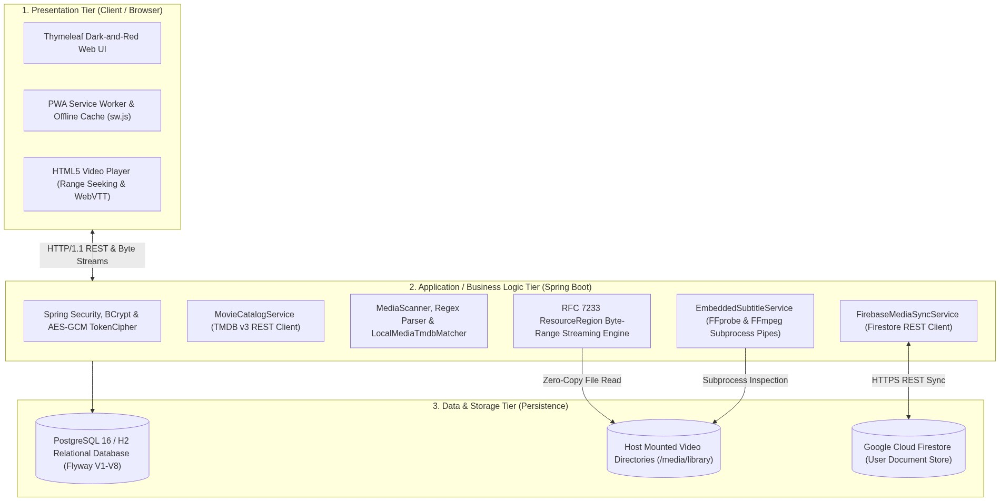
The system implements a classic **3-Tier Layered Architecture** with decoupled ports-and-adapters for external services:

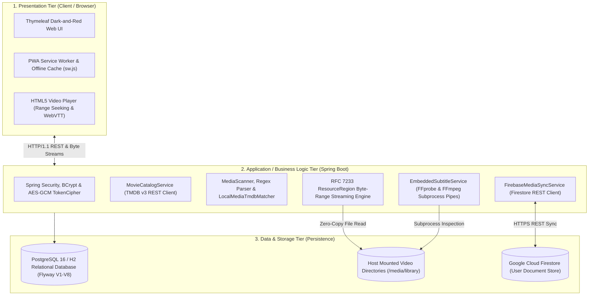
```mermaid
flowchart TD
    subgraph PresentationTier ["1. Presentation Tier (Client / Browser)"]
        HTML5["Thymeleaf Dark-and-Red Web UI"]
        PWA["PWA Service Worker & Offline Cache (sw.js)"]
        CinemaPlayer["HTML5 Video Player (Range Seeking & WebVTT)"]
    end

    subgraph ApplicationTier ["2. Application / Business Logic Tier (Spring Boot)"]
        SecurityModule["Spring Security, BCrypt & AES-GCM TokenCipher"]
        CatalogModule["MovieCatalogService (TMDB v3 REST Client)"]
        LibraryModule["MediaScanner, Regex Parser & LocalMediaTmdbMatcher"]
        SubtitleModule["EmbeddedSubtitleService (FFprobe & FFmpeg Subprocess Pipes)"]
        SyncModule["FirebaseMediaSyncService (Firestore REST Client)"]
        StreamingEngine["RFC 7233 ResourceRegion Byte-Range Streaming Engine"]
    end

    subgraph DataTier ["3. Data & Storage Tier (Persistence)"]
        PostgreSQL[("PostgreSQL 16 / H2 Relational Database (Flyway V1-V8)")]
        MediaStorage[("Host Mounted Video Directories (/media/library)")]
        CloudFirestore[("Google Cloud Firestore (User Document Store)")]
    end

    PresentationTier <-->|HTTP/1.1 REST & Byte Streams| ApplicationTier
    ApplicationTier --> PostgreSQL
    StreamingEngine -->|Zero-Copy File Read| MediaStorage
    SubtitleModule -->|Subprocess Inspection| MediaStorage
    SyncModule <-->|HTTPS REST Sync| CloudFirestore
```

---

## 4.2 Use Case Modeling & Actor Descriptions

### 4.2.1 Detailed Tabular Use Case Specifications

#### UC01: User Registration, Local Authentication & Firebase Federation
| Field | Specification Details |
| :--- | :--- |
| **Use Case ID** | **UC01** |
| **Use Case Name** | User Registration, Authentication & Identity Federation |
| **Primary Actor** | Unauthenticated Visitor / Registered User |
| **Secondary Actors** | Firebase Identity Toolkit API, Local Relational Database Engine |
| **Description** | Enables a visitor to register a new account or authenticate an existing session using local BCrypt password verification or federated Firebase Authentication with persistent session tokens. |
| **Preconditions** | System is online and reachable via HTTP/HTTPS port 8080 (or 8081). Local database is initialized with Flyway V1-V7 schema. |
| **Trigger** | User navigates to `/login` or `/signup` and submits the authentication form. |
| **Main Success Scenario** | 1. User accesses the `/login` view.<br>2. User enters valid email address and password, optionally checking "Keep me signed in".<br>3. Security filter chain intercepts request and routes to `FirebaseAuthenticationProvider`.<br>4. Provider queries Firebase Identity Toolkit via REST API with user credentials.<br>5. Firebase validates credentials and returns `idToken`, `refreshToken`, and `localId`.<br>6. Provider queries local `app_user` table for matching email.<br>7. System links `firebase_uid` to `app_user` record (Flyway V6).<br>8. `FirebaseCredentialService` encrypts `refreshToken` using AES-GCM-256 (`TokenCipher`) and persists in `firebase_credential`.<br>9. If Remember-Me is checked, `persistent_logins` generates series and token hashes.<br>10. System establishes authenticated `SecurityContext` and redirects user to `/`. |
| **Alternative Flows** | **A1: Firebase Unconfigured or Offline:**<br>1. In step 4, if Firebase properties are absent or network is unreachable, provider falls back to local database authentication.<br>2. System queries `app_user` for email and compares password hash via `BCryptPasswordEncoder`.<br>3. If match succeeds, local session is established without cloud sync capabilities.<br>**A2: Account Registration (`/signup`):**<br>1. User provides email, display name, and password (>= 8 chars).<br>2. System verifies email uniqueness in `app_user`.<br>3. Password is encrypted with BCrypt (cost factor 10) and record inserted into `app_user`.<br>4. If Firebase is active, account is automatically provisioned in Firebase Auth. |
| **Exception Flows** | **E1: Duplicate Email:** System rejects registration with HTTP 409 Conflict and displays "An account with this email already exists".<br>**E2: Invalid Credentials:** System displays "Invalid email or password" without revealing which parameter was incorrect.<br>**E3: Compromised Remember-Me Cookie:** If token in cookie does not match database series, system purges all remember-me tokens for the user and requires password login. |
| **Postconditions** | Authenticated user session established with role `ROLE_USER`. Session cookies set with `HttpOnly` and `SameSite=Lax`. |
| **Priority** | High (Must-Have) |

#### UC02: TMDB Catalog Exploration, Multi-Filtering & Detail Retrieval
| Field | Specification Details |
| :--- | :--- |
| **Use Case ID** | **UC02** |
| **Use Case Name** | TMDB Catalog Exploration, Search & Multi-Parametric Filtering |
| **Primary Actor** | Registered User / Guest Viewer |
| **Secondary Actors** | The Movie Database (TMDB) v3 API Server |
| **Description** | Enables users to browse curated catalog carousels, perform multi-parametric searches with genre, release year, and minimum rating filters, and inspect comprehensive media metadata including cast and trailers. |
| **Preconditions** | Valid `TMDB_API_KEY` configured in application environment. External network access to `api.themoviedb.org` available. |
| **Trigger** | User visits home page (`/`) or submits a query on `/search`. |
| **Main Success Scenario** | 1. User navigates to `/search` or home view.<br>2. `CatalogController` invokes `MovieCatalogService`.<br>3. Service requests trending and curated rails from TMDB v3 REST API endpoints.<br>4. TMDB returns JSON payloads containing titles, release dates, poster paths, and vote averages.<br>5. Service maps payloads into domain records (`MovieCard`, `MediaRail`).<br>6. View renders carousels with dark-and-red cinema aesthetic.<br>7. User inputs search string "Interstellar", selects Genre "Sci-Fi (878)", Year "2014", and Min Rating "8.0".<br>8. Controller invokes `search()` with filtered query parameters.<br>9. TMDB returns matching results; service applies post-filtering and sorts by popularity.<br>10. User clicks on title card; system displays `/movie/{id}` with synopsis, runtime, cast, and embedded YouTube trailer. |
| **Alternative Flows** | **A1: TMDB API Key Missing or Service Down:**<br>1. System catches `TmdbNotConfiguredException` or `RestClientException`.<br>2. System displays informative warning banner: "TMDB catalog service is temporarily unavailable. Local media library and offline watchlists remain fully operational."<br>3. Discovery rails are gracefully omitted; search redirects to local library search. |
| **Exception Flows** | **E1: Malformed Search Parameters:** System sanitizes query inputs and ignores non-numeric year/genre parameters without throwing HTTP 500.<br>**E2: Invalid TMDB ID:** Detail endpoint returns HTTP 404 with custom error page. |
| **Postconditions** | Catalog results presented with image assets loaded from TMDB CDN or fallback placeholders. |
| **Priority** | High (Must-Have) |

#### UC03: Personal Watchlist & Watched Rating Management
| Field | Specification Details |
| :--- | :--- |
| **Use Case ID** | **UC03** |
| **Use Case Name** | Personal Watchlist & Watched Rating Management |
| **Primary Actor** | Authenticated User |
| **Secondary Actors** | Local Relational Database, Firebase Media Sync Engine |
| **Description** | Allows an authenticated user to save titles to a prospective Watchlist, log watched titles with 1-to-5 star ratings, update ratings, and trigger background cloud synchronization. |
| **Preconditions** | User must be logged in (`SecurityContext` contains valid `Account` principal). |
| **Trigger** | User clicks "Add to Watchlist", "Mark as Watched", or selects star rating on title modal. |
| **Main Success Scenario** | 1. User clicks "Mark as Watched" on a title card.<br>2. System opens rating modal permitting 1 to 5 star selection.<br>3. User selects 5 stars and submits form (POST to `/watched/add`).<br>4. `WatchedController` invokes `WatchedService.recordWatched()`.<br>5. Service checks for existing entry in `watched_entry`.<br>6. Service persists record with `user_id`, `tmdb_id`, `media_type`, `user_rating=5`, and `watched_at=CURRENT_TIMESTAMP`.<br>7. If title currently exists in `watchlist_entry`, system automatically removes it to prevent list conflict.<br>8. Service dispatches asynchronous sync event to `FirebaseMediaSyncService`.<br>9. System returns HTTP 200 JSON confirmation and updates button state to "Watched (5 Stars)". |
| **Alternative Flows** | **A1: Removing from Watchlist:** User clicks "Remove"; system executes DELETE in `watchlist_entry` and reconciles deletion in Cloud Firestore.<br>**A2: Updating Star Rating:** User re-rates a watched title; system executes UPDATE on `watched_entry.user_rating` and syncs timestamp. |
| **Exception Flows** | **E1: Unauthenticated Mutation:** Attempting list modification without active session redirects to `/login`.<br>**E2: Invalid Rating Value:** Rating outside 1-5 range is rejected by database check constraint (`watched_entry_user_rating_check`). |
| **Postconditions** | Relational database updated. Firestore cloud document created or updated. Dynamic recommendations updated on next home page visit. |
| **Priority** | High (Must-Have) |

#### UC04: Zero-Copy Byte-Range Video Streaming
| Field | Specification Details |
| :--- | :--- |
| **Use Case ID** | **UC04** |
| **Use Case Name** | Zero-Copy HTTP 206 Byte-Range Video Streaming |
| **Primary Actor** | Registered User / Guest Viewer |
| **Secondary Actors** | Host Filesystem Storage Volume, Browser HTML5 Video Engine |
| **Description** | Delivers high-definition local media files directly to web browsers using RFC 7233 partial content range requests without CPU-intensive server-side transcoding. |
| **Preconditions** | Media file exists in indexed `local_media` table and is accessible on host filesystem. User has permission to access library. |
| **Trigger** | User clicks "Play" button on movie or episode card (`/library/{id}/play`). |
| **Main Success Scenario** | 1. User loads cinema player interface.<br>2. HTML5 `<video>` element issues GET request to `/library/{id}/video` with header `Range: bytes=0-`.<br>3. `LibraryController.video()` invokes `scanner.require(id)`.<br>4. Controller retrieves canonical path and passes to `checkedPath()` for traversal security verification.<br>5. Controller resolves total file size on disk.<br>6. Controller packages file slice into Spring `ResourceRegion` with start offset 0 and chunk length.<br>7. Controller returns HTTP 206 Partial Content with headers `Content-Range: bytes 0-chunk/total`, `Accept-Ranges: bytes`, and `Content-Type: video/mp4`.<br>8. Browser buffers initial chunk and begins immediate hardware-accelerated playback.<br>9. User seeks timeline forward to 01:15:30.<br>10. Browser issues new range request: `Range: bytes=1572864000-`.<br>11. Controller instantly seeks file descriptor to byte offset 1572864000 and streams new chunk.<br>12. Playback resumes without buffering or CPU re-encoding spikes. |
| **Alternative Flows** | **A1: Full File Download Request:** If request lacks `Range` header, controller returns HTTP 200 with full file payload and `Accept-Ranges: bytes`. |
| **Exception Flows** | **E1: Path Traversal Attack:** If path contains `../` or escapes configured scan roots, system throws `SecurityException` and returns HTTP 400 Bad Request.<br>**E2: Missing File on Disk:** If file was deleted or drive unmounted, system returns HTTP 404 Not Found. |
| **Postconditions** | Video streamed seamlessly with host CPU utilization remaining under 2%. |
| **Priority** | High (Must-Have) |

#### UC05: Embedded & External Subtitle Transcoding
| Field | Specification Details |
| :--- | :--- |
| **Use Case ID** | **UC05** |
| **Use Case Name** | Dynamic Subtitle Track Discovery & On-the-Fly WebVTT Transcoding |
| **Primary Actor** | Registered User / Cinema Player |
| **Secondary Actors** | FFmpeg Binary, FFprobe Binary, Host Media Storage |
| **Description** | Discovers embedded text subtitle tracks within MKV/MP4 containers and transcode them in real-time to W3C WebVTT format, alongside matching external `.srt` sidecars. |
| **Preconditions** | Video file contains text subtitle streams or matching external sidecar. FFmpeg and FFprobe binaries are present on system PATH. |
| **Trigger** | Cinema player initializes tracks modal or user selects a subtitle language from player menu. |
| **Main Success Scenario** | 1. Player requests available tracks via `/library/{id}/subtitle/tracks`.<br>2. `LibraryController` queries `EmbeddedSubtitleService.tracks()`.<br>3. Service executes `ffprobe` subprocess with JSON output formatting: `ffprobe -v error -show_entries stream=index,codec_name:stream_tags=language,title -of json <file>`.<br>4. Service parses JSON output, identifying text streams (`subrip`, `ass`, `mov_text`).<br>5. System checks filesystem for matching sidecars (`movie.en.srt`, `movie.vtt`).<br>6. Controller returns JSON array of selectable subtitle tracks.<br>7. User clicks "English (Embedded Track #2)".<br>8. Player sets subtitle track source to `/library/{id}/subtitle/embedded/2`.<br>9. Controller invokes `EmbeddedSubtitleService.streamWebvtt()`.<br>10. Service spawns `ffmpeg` subprocess: `ffmpeg -v error -i <file> -map 0:2 -f webvtt -`.<br>11. Process stdout stream is piped directly into HTTP response body with MIME type `text/vtt;charset=UTF-8`.<br>12. Browser displays synchronized text captions on video canvas. |
| **Alternative Flows** | **A1: External SRT Sidecar Selected:** System reads `.srt` file, replaces comma timecodes with periods (`00:00:00,000` -> `00:00:00.000`), prepends `WEBVTT`, and returns stream. |
| **Exception Flows** | **E1: Bitmap Subtitles (PGS/VOBSUB):** System marks stream as unsupported; notifies user that image-based DVD/Blu-ray subtitles cannot be rendered in HTML5 players.<br>**E2: FFmpeg Process Timeout:** If subprocess fails to emit output within 15 seconds, process is terminated and HTTP 422 returned. |
| **Postconditions** | Text captions synchronized with audio stream without generating temporary files on disk. |
| **Priority** | High (Must-Have) |

#### UC06: Cloud Firestore Bidirectional Synchronization
| Field | Specification Details |
| :--- | :--- |
| **Use Case ID** | **UC06** |
| **Use Case Name** | Dual-Tier Cloud Firestore Synchronization & Offline Reconciliation |
| **Primary Actor** | Authenticated User |
| **Secondary Actors** | Google Cloud Firestore REST API, Firebase Identity API |
| **Description** | Synchronizes local watchlist and watched entries with Cloud Firestore documents, resolving conflicts using modified timestamps and enabling offline list editing. |
| **Preconditions** | User account is linked to valid `firebase_uid`. Network connectivity to Google Cloud APIs is available. |
| **Trigger** | User logs in, mutates list, or background sync timer fires. |
| **Main Success Scenario** | 1. `FirebaseMediaSyncService` initiates synchronization.<br>2. Service retrieves user's valid Firebase ID token (refreshing via `TokenCipher` if expired).<br>3. Service requests all documents from Firestore path `/users/{uid}/watchlist` and `/users/{uid}/watched`.<br>4. Service fetches all corresponding local entries from PostgreSQL.<br>5. Service executes reconciliation algorithm: compares `updatedAt` / `createdAt` timestamps.<br>6. If remote Firestore record is newer, local database record is upserted.<br>7. If local database record is newer, remote Firestore document is patched via REST API.<br>8. Deletions made on one platform are propagated to the other.<br>9. Sync state timestamp updated in user session. |
| **Alternative Flows** | **A1: Offline Mode (No Internet):** System catches network failure; preserves all local modifications in PostgreSQL. Sets flag `sync_pending=true`. Operates entirely offline without blocking UI. |
| **Exception Flows** | **E1: Firebase Token Expired:** System decrypts stored refresh token and requests new ID token from Firebase Identity Toolkit. If refresh token is revoked, user is prompted to re-enter cloud password. |
| **Postconditions** | Watchlist and watched records identical across local PC and cloud-connected devices. |
| **Priority** | High (Must-Have) |

#### UC07: Filesystem Directory Scanning & Media Indexing
| Field | Specification Details |
| :--- | :--- |
| **Use Case ID** | **UC07** |
| **Use Case Name** | Filesystem Traversal, Hierarchy Parsing & Media Indexing |
| **Primary Actor** | Media Curator / Background System Scheduler |
| **Secondary Actors** | Host Filesystem, Local Media Repository |
| **Description** | Traverses configured root folders, extracts video files, parses season/episode numbering via regular expressions, and maintains an up-to-date relational catalog. |
| **Preconditions** | Directory paths exist and are readable by application process (`media_scan_root`). |
| **Trigger** | Scheduled background task runs (every 60s) or user clicks "Scan Now" in Settings. |
| **Main Success Scenario** | 1. `MediaScanner` queries `media_scan_root` table for active paths.<br>2. Scanner iterates through paths, invoking `Files.walk()`.<br>3. Scanner filters files matching `.mp4`, `.mkv`, `.avi`, `.webm`, `.mov`.<br>4. For each file, scanner checks if path already exists in `local_media`.<br>5. If existing, scanner verifies file modification time and updates `last_seen_at`.<br>6. If new, scanner evaluates filename against regular expression patterns (`S(?<season>\d+)E(?<ep>\d+)`, `Season (?<s>\d+) Episode (?<e>\d+)`).<br>7. If TV pattern matches, item classified as `EPISODE` with extracted series, season, and episode numbers.<br>8. If pattern does not match, item classified as `MOVIE` with sanitized display title.<br>9. Record saved to `local_media`.<br>10. Scanner queries `local_media` for records where `last_seen_at < scan_start_time` (deleted files).<br>11. Stale records pruned from database. |
| **Alternative Flows** | **A1: Excluded System Directories:** Scanner encounters `$RECYCLE.BIN`, `System Volume Information`, or `.git`; scanner skips entire branch without processing. |
| **Exception Flows** | **E1: Permission Denied on Directory:** Scanner logs warning and continues traversal of remaining accessible folders without crashing. |
| **Postconditions** | `local_media` table accurately reflects current physical disk storage. |
| **Priority** | High (Must-Have) |

#### UC08: TMDB Fuzzy Title Matching & Local Poster Caching
| Field | Specification Details |
| :--- | :--- |
| **Use Case ID** | **UC08** |
| **Use Case Name** | TMDB Fuzzy Title Matching & Binary Poster Caching |
| **Primary Actor** | System Background Matcher / Media Administrator |
| **Secondary Actors** | The Movie Database (TMDB) API, PostgreSQL Database |
| **Description** | Associates local video files with official TMDB catalog metadata using Levenshtein distance scoring and downloads poster images into local binary storage for offline use. |
| **Preconditions** | Local files indexed in `local_media`. TMDB API key configured and reachable. |
| **Trigger** | New unlinked media discovered during scan or user triggers manual rematch. |
| **Main Success Scenario** | 1. `LocalMediaTmdbMatcher` queries unlinked items from `local_media`.<br>2. Matcher strips release year, resolution tags (1080p, 720p), and codec tags (x264, x265) from title.<br>3. Matcher queries TMDB search endpoint (`/3/search/movie` or `/3/search/tv`).<br>4. TMDB returns candidate cards.<br>5. Matcher computes normalized Levenshtein similarity score against candidates.<br>6. Candidate with highest score >= 0.55 selected as match.<br>7. Matcher attaches `tmdb_id`, `tmdb_title`, `tmdb_overview`, and `tmdb_poster_path` to `local_media`.<br>8. `LocalPosterCacheService` checks if poster is already cached in `local_media_poster_cache`.<br>9. If missing, service downloads poster binary bytes from TMDB CDN.<br>10. Service saves image into `local_media_poster_cache` with MIME type and binary `BYTEA` payload.<br>11. User reloads `/library`; view displays high-resolution poster served locally from PostgreSQL. |
| **Alternative Flows** | **A1: Low Match Score (< 0.55):** System flags item as unlinked; leaves display title intact and permits user manual rematch via UI modal. |
| **Exception Flows** | **E1: CDN Download Fails:** System retains TMDB metadata reference and retries poster download during subsequent scan cycle. |
| **Postconditions** | Metadata attached and poster stored in database, enabling full offline visual rendering. |
| **Priority** | High (Must-Have) |


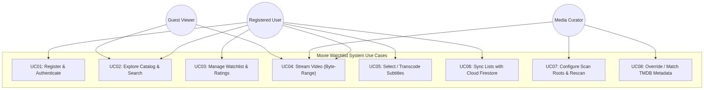

### Primary Actors
1. **Registered User:** Signs in, browses catalog, searches titles, manages personal watchlist, logs ratings, and streams local media.
2. **Media Administrator / Curator:** Configures scan roots, initiates manual library scans, and manually overrides title matching.
3. **Unauthenticated / Guest Viewer:** In `preview` profile, browses public catalog and streams local media.

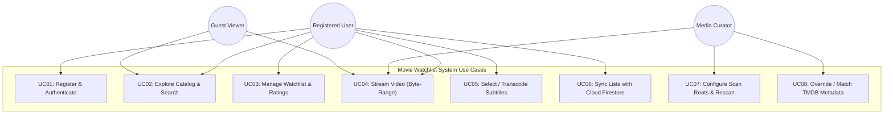
```mermaid
flowchart TD
    User((Registered User))
    Admin((Media Curator))
    Guest((Guest Viewer))

    subgraph UseCases ["Movie Watchlist System Use Cases"]
        UC01["UC01: Register & Authenticate"]
        UC02["UC02: Explore Catalog & Search"]
        UC03["UC03: Manage Watchlist & Ratings"]
        UC04["UC04: Stream Video (Byte-Range)"]
        UC05["UC05: Select / Transcode Subtitles"]
        UC06["UC06: Sync Lists with Cloud Firestore"]
        UC07["UC07: Configure Scan Roots & Rescan"]
        UC08["UC08: Override / Match TMDB Metadata"]
    end

    User --> UC01
    User --> UC02
    User --> UC03
    User --> UC04
    User --> UC05
    User --> UC06

    Admin --> UC07
    Admin --> UC08
    Admin --> UC04

    Guest --> UC02
    Guest --> UC04
```

---

## 4.3 Activity Diagrams

### Figure 4.3.1: Activity Diagram: Media Library Scan & Auto-Matching

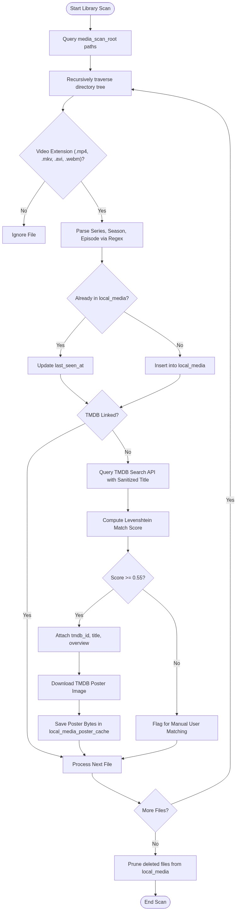
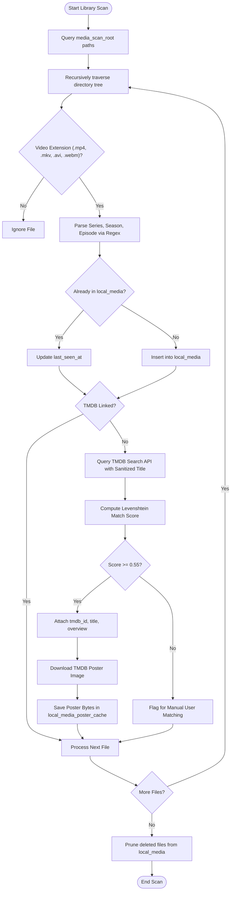
```mermaid
flowchart TD
    Start([Start Library Scan]) --> GetRoots[Query media_scan_root paths]
    GetRoots --> WalkFiles[Recursively traverse directory tree]
    WalkFiles --> FilterExt{"Video Extension (.mp4, .mkv, .avi, .webm)?"}
    FilterExt -- No --> SkipFile[Ignore File]
    FilterExt -- Yes --> ParseRegex[Parse Series, Season, Episode via Regex]
    ParseRegex --> CheckDB{"Already in local_media?"}
    CheckDB -- Yes --> UpdateTimestamp[Update last_seen_at]
    CheckDB -- No --> InsertMedia[Insert into local_media]
    UpdateTimestamp --> CheckTMDB{"TMDB Linked?"}
    InsertMedia --> CheckTMDB
    CheckTMDB -- Yes --> DoneItem[Process Next File]
    CheckTMDB -- No --> SearchTMDB[Query TMDB Search API with Sanitized Title]
    SearchTMDB --> CalcLev[Compute Levenshtein Match Score]
    CalcLev --> ScoreThreshold{"Score >= 0.55?"}
    ScoreThreshold -- Yes --> AttachMetadata[Attach tmdb_id, title, overview]
    AttachMetadata --> DownloadPoster[Download TMDB Poster Image]
    DownloadPoster --> CacheDB[Save Poster Bytes in local_media_poster_cache]
    CacheDB --> DoneItem
    ScoreThreshold -- No --> FlagManual[Flag for Manual User Matching]
    FlagManual --> DoneItem
    DoneItem --> MoreFiles{"More Files?"}
    MoreFiles -- Yes --> WalkFiles
    MoreFiles -- No --> PruneMissing[Prune deleted files from local_media]
    PruneMissing --> End([End Scan])
```

### Figure 4.3.2: Activity Diagram: Subtitle Extraction & Cinema Playback

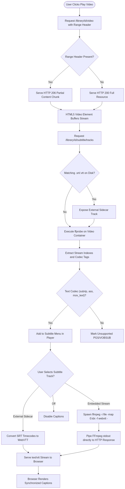
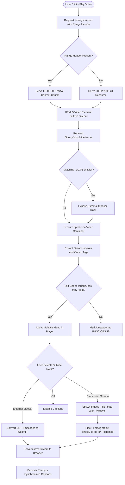
```mermaid
flowchart TD
    StartPlay([User Clicks Play Video]) --> ReqVideo[Request /library/id/video with Range Header]
    ReqVideo --> CheckRange{"Range Header Present?"}
    CheckRange -- Yes --> Serve206[Serve HTTP 206 Partial Content Chunk]
    CheckRange -- No --> Serve200[Serve HTTP 200 Full Resource]
    Serve206 --> LoadPlayer[HTML5 Video Element Buffers Stream]
    Serve200 --> LoadPlayer
    LoadPlayer --> QueryTracks[Request /library/id/subtitle/tracks]
    QueryTracks --> CheckSidecar{"Matching .srt/.vtt on Disk?"}
    CheckSidecar -- Yes --> AddExternal[Expose External Sidecar Track]
    CheckSidecar -- No --> ExecProbe[Execute ffprobe on Video Container]
    AddExternal --> ExecProbe
    ExecProbe --> ParseStreams[Extract Stream Indexes and Codec Tags]
    ParseStreams --> FilterText{"Text Codec (subrip, ass, mov_text)?"}
    FilterText -- Yes --> ExposeEmbedded[Add to Subtitle Menu in Player]
    FilterText -- No --> FlagBitmap[Mark Unsupported PGS/VOBSUB]
    ExposeEmbedded --> UserSelectTrack{"User Selects Subtitle Track?"}
    UserSelectTrack -- External Sidecar --> ConvSRT[Convert SRT Timecodes to WebVTT]
    ConvSRT --> StreamVTT[Serve text/vtt Stream to Browser]
    UserSelectTrack -- Embedded Stream --> SpawnFFmpeg[Spawn ffmpeg -i file -map 0:idx -f webvtt -]
    SpawnFFmpeg --> PipeVTT[Pipe FFmpeg stdout directly to HTTP Response]
    PipeVTT --> StreamVTT
    UserSelectTrack -- Off --> HideSubs[Disable Captions]
    StreamVTT --> RenderSubs[Browser Renders Synchronized Captions]
```

---

## 4.4 Sequence Diagrams

### Figure 4.4.1: Sequence Diagram: System Initialization & Authentication

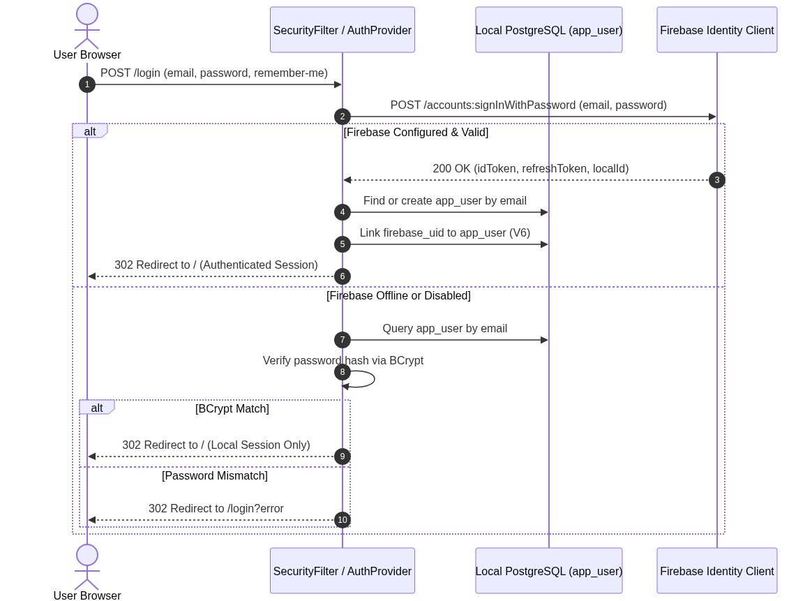
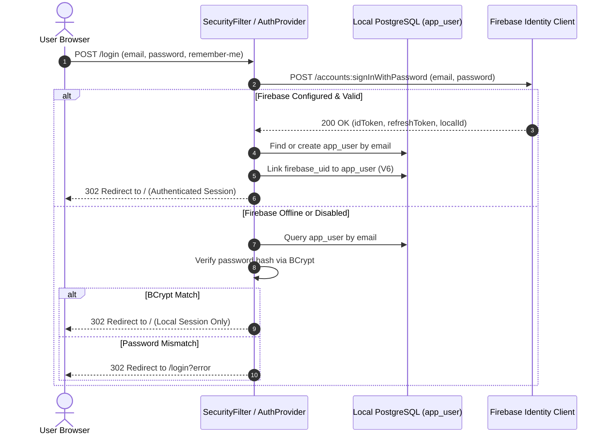
```mermaid
sequenceDiagram
    autonumber
    actor User as User Browser
    participant Sec as SecurityFilter / AuthProvider
    participant LocalDB as Local PostgreSQL (app_user)
    participant FB as Firebase Identity Client

    User->>Sec: POST /login (email, password, remember-me)
    Sec->>FB: POST /accounts:signInWithPassword (email, password)
    alt Firebase Configured & Valid
        FB-->>Sec: 200 OK (idToken, refreshToken, localId)
        Sec->>LocalDB: Find or create app_user by email
        Sec->>LocalDB: Link firebase_uid to app_user (V6)
        Sec-->>User: 302 Redirect to / (Authenticated Session)
    else Firebase Offline or Disabled
        Sec->>LocalDB: Query app_user by email
        Sec->>Sec: Verify password hash via BCrypt
        alt BCrypt Match
            Sec-->>User: 302 Redirect to / (Local Session Only)
        else Password Mismatch
            Sec-->>User: 302 Redirect to /login?error
        end
    end
```

### Figure 4.4.2: Sequence Diagram: Persistent Session & Remember-Me Token Resolution

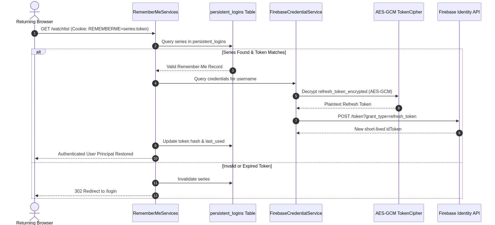
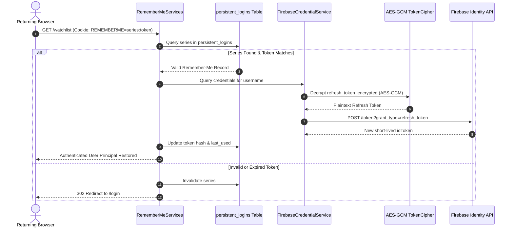
```mermaid
sequenceDiagram
    autonumber
    actor Browser as Returning Browser
    participant Sec as RememberMeServices
    participant TokenRepo as persistent_logins Table
    participant CredSvc as FirebaseCredentialService
    participant Cipher as AES-GCM TokenCipher
    participant FB as Firebase Identity API

    Browser->>Sec: GET /watchlist (Cookie: REMEMBERME=series:token)
    Sec->>TokenRepo: Query series in persistent_logins
    alt Series Found & Token Matches
        TokenRepo-->>Sec: Valid Remember-Me Record
        Sec->>CredSvc: Query credentials for username
        CredSvc->>Cipher: Decrypt refresh_token_encrypted (AES-GCM)
        Cipher-->>CredSvc: Plaintext Refresh Token
        CredSvc->>FB: POST /token?grant_type=refresh_token
        FB-->>CredSvc: New short-lived idToken
        Sec->>TokenRepo: Update token hash & last_used
        Sec-->>Browser: Authenticated User Principal Restored
    else Invalid or Expired Token
        Sec->>TokenRepo: Invalidate series
        Sec-->>Browser: 302 Redirect to /login
    end
```

### Figure 4.4.3: Sequence Diagram: TMDB Discovery & Multi-Parametric Search

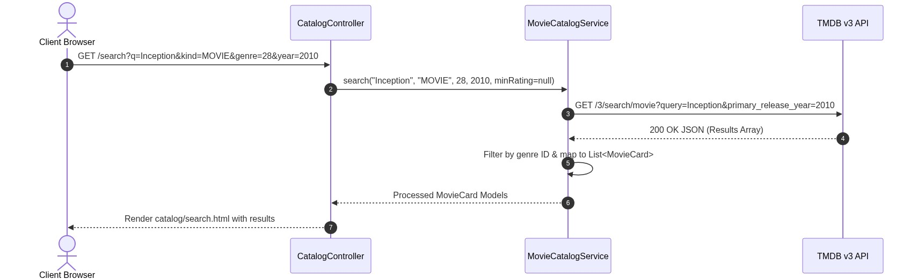
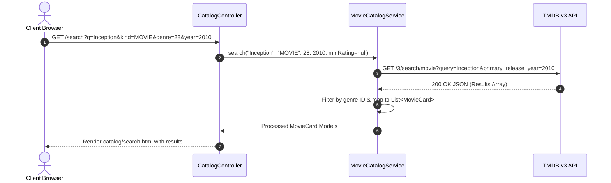
```mermaid
sequenceDiagram
    autonumber
    actor User as Client Browser
    participant Ctrl as CatalogController
    participant Svc as MovieCatalogService
    participant TMDB as TMDB v3 API

    User->>Ctrl: GET /search?q=Inception&kind=MOVIE&genre=28&year=2010
    Ctrl->>Svc: search("Inception", "MOVIE", 28, 2010, minRating=null)
    Svc->>TMDB: GET /3/search/movie?query=Inception&primary_release_year=2010
    TMDB-->>Svc: 200 OK JSON (Results Array)
    Svc->>Svc: Filter by genre ID & map to List<MovieCard>
    Svc-->>Ctrl: Processed MovieCard Models
    Ctrl-->>User: Render catalog/search.html with results
```

### Figure 4.4.4: Sequence Diagram: Watchlist & Watched Rating Submission

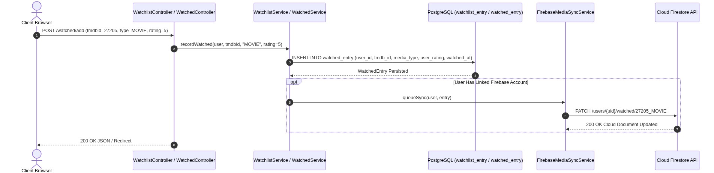
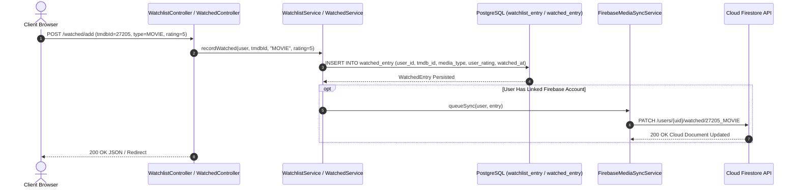
```mermaid
sequenceDiagram
    autonumber
    actor User as Client Browser
    participant WatchCtrl as WatchlistController / WatchedController
    participant Svc as WatchlistService / WatchedService
    participant DB as PostgreSQL (watchlist_entry / watched_entry)
    participant Sync as FirebaseMediaSyncService
    participant Firestore as Cloud Firestore API

    User->>WatchCtrl: POST /watched/add (tmdbId=27205, type=MOVIE, rating=5)
    WatchCtrl->>Svc: recordWatched(user, tmdbId, "MOVIE", rating=5)
    Svc->>DB: INSERT INTO watched_entry (user_id, tmdb_id, media_type, user_rating, watched_at)
    DB-->>Svc: WatchedEntry Persisted
    opt User Has Linked Firebase Account
        Svc->>Sync: queueSync(user, entry)
        Sync->>Firestore: PATCH /users/{uid}/watched/27205_MOVIE
        Firestore-->>Sync: 200 OK Cloud Document Updated
    end
    WatchCtrl-->>User: 200 OK JSON / Redirect
```

### Figure 4.4.5: Sequence Diagram: Filesystem Traversal & Regex Hierarchy Parsing

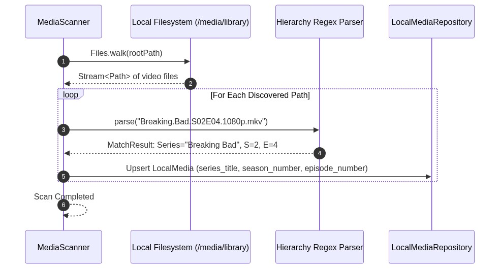
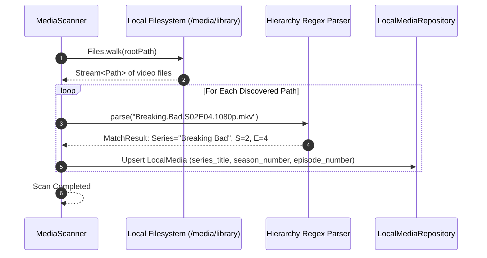
```mermaid
sequenceDiagram
    autonumber
    participant Scanner as MediaScanner
    participant Disk as Local Filesystem (/media/library)
    participant Regex as Hierarchy Regex Parser
    participant DB as LocalMediaRepository

    Scanner->>Disk: Files.walk(rootPath)
    Disk-->>Scanner: Stream<Path> of video files
    loop For Each Discovered Path
        Scanner->>Regex: parse("Breaking.Bad.S02E04.1080p.mkv")
        Regex-->>Scanner: MatchResult: Series="Breaking Bad", S=2, E=4
        Scanner->>DB: Upsert LocalMedia (series_title, season_number, episode_number)
    end
    Scanner-->>Scanner: Scan Completed
```

### Figure 4.4.6: Sequence Diagram: TMDB Fuzzy Matching & Local Poster Caching

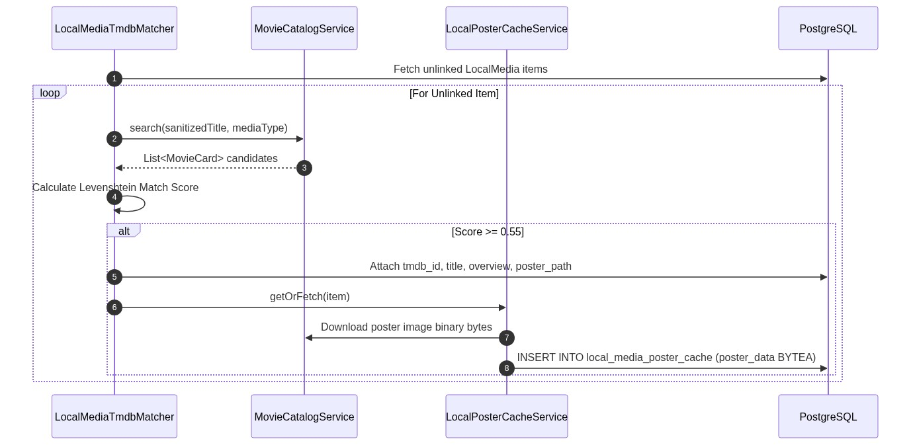
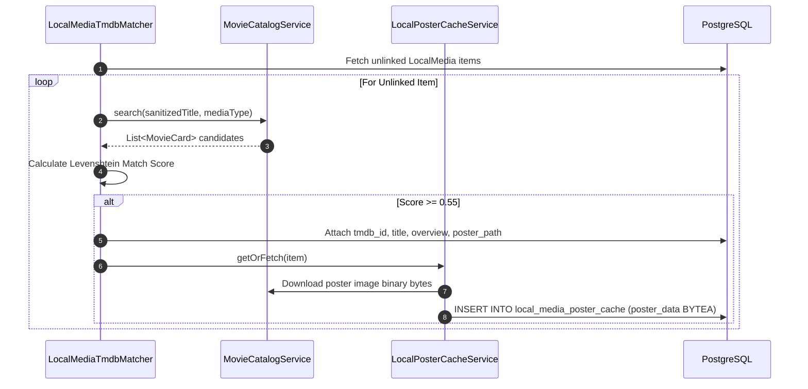
```mermaid
sequenceDiagram
    autonumber
    participant Matcher as LocalMediaTmdbMatcher
    participant TMDB as MovieCatalogService
    participant Cache as LocalPosterCacheService
    participant DB as PostgreSQL

    Matcher->>DB: Fetch unlinked LocalMedia items
    loop For Unlinked Item
        Matcher->>TMDB: search(sanitizedTitle, mediaType)
        TMDB-->>Matcher: List<MovieCard> candidates
        Matcher->>Matcher: Calculate Levenshtein Match Score
        alt Score >= 0.55
            Matcher->>DB: Attach tmdb_id, title, overview, poster_path
            Matcher->>Cache: getOrFetch(item)
            Cache->>TMDB: Download poster image binary bytes
            Cache->>DB: INSERT INTO local_media_poster_cache (poster_data BYTEA)
        end
    end
```

### Figure 4.4.7: Sequence Diagram: HTTP 206 Byte-Range Video Streaming

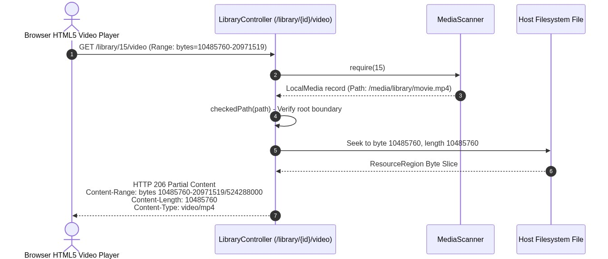
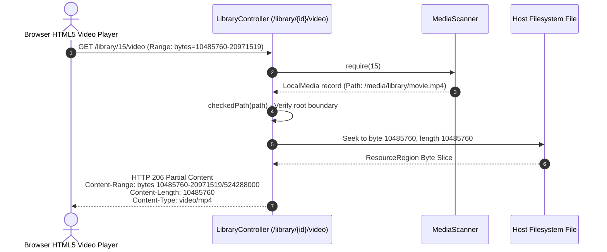
```mermaid
sequenceDiagram
    autonumber
    actor VideoPlayer as Browser HTML5 Video Player
    participant Ctrl as LibraryController (/library/{id}/video)
    participant Scanner as MediaScanner
    participant Disk as Host Filesystem File

    VideoPlayer->>Ctrl: GET /library/15/video (Range: bytes=10485760-20971519)
    Ctrl->>Scanner: require(15)
    Scanner-->>Ctrl: LocalMedia record (Path: /media/library/movie.mp4)
    Ctrl->>Ctrl: checkedPath(path) - Verify root boundary
    Ctrl->>Disk: Seek to byte 10485760, length 10485760
    Disk-->>Ctrl: ResourceRegion Byte Slice
    Ctrl-->>VideoPlayer: HTTP 206 Partial Content<br/>Content-Range: bytes 10485760-20971519/524288000<br/>Content-Length: 10485760<br/>Content-Type: video/mp4
```

### Figure 4.4.8: Sequence Diagram: On-the-Fly FFmpeg WebVTT Subtitle Extraction

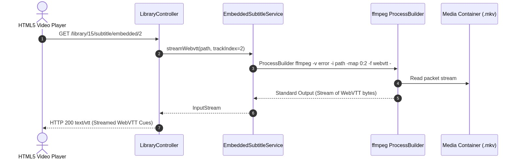
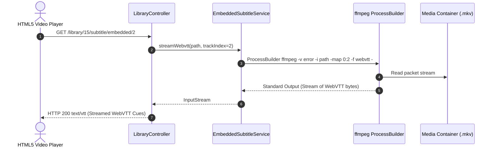
```mermaid
sequenceDiagram
    autonumber
    actor Player as HTML5 Video Player
    participant Ctrl as LibraryController
    participant SubSvc as EmbeddedSubtitleService
    participant FFmpeg as ffmpeg ProcessBuilder
    participant Disk as Media Container (.mkv)

    Player->>Ctrl: GET /library/15/subtitle/embedded/2
    Ctrl->>SubSvc: streamWebvtt(path, trackIndex=2)
    SubSvc->>FFmpeg: ProcessBuilder ffmpeg -v error -i path -map 0:2 -f webvtt -
    FFmpeg->>Disk: Read packet stream #2
    FFmpeg-->>SubSvc: Standard Output (Stream of WebVTT bytes)
    SubSvc-->>Ctrl: InputStream
    Ctrl-->>Player: HTTP 200 text/vtt (Streamed WebVTT Cues)
```

### Figure 4.4.9: Sequence Diagram: Cloud Firestore Two-Way Sync Reconciliation

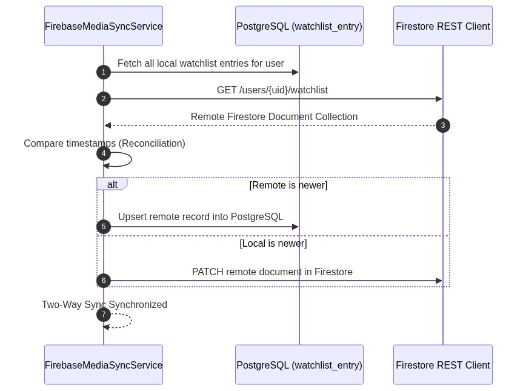
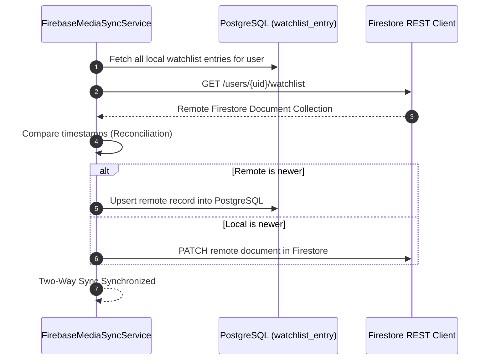
```mermaid
sequenceDiagram
    autonumber
    participant Sync as FirebaseMediaSyncService
    participant LocalDB as PostgreSQL (watchlist_entry)
    participant Firestore as Firestore REST Client

    Sync->>LocalDB: Fetch all local watchlist entries for user
    Sync->>Firestore: GET /users/{uid}/watchlist
    Firestore-->>Sync: Remote Firestore Document Collection
    Sync->>Sync: Compare timestamps (Reconciliation)
    alt Remote is newer
        Sync->>LocalDB: Upsert remote record into PostgreSQL
    else Local is newer
        Sync->>Firestore: PATCH remote document in Firestore
    end
    Sync-->>Sync: Two-Way Sync Synchronized
```

---

## 4.5 Class Diagram & Structural Domain Model

### Figure 4.5.1: Complete System Class Diagram

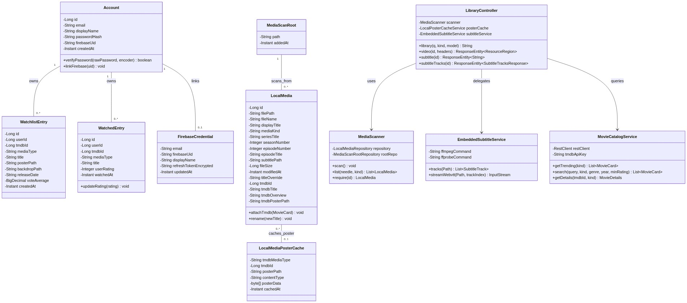
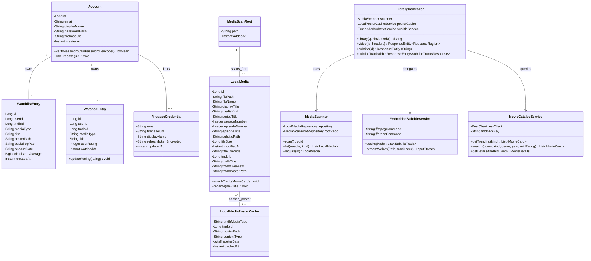
```mermaid
classDiagram
    class Account {
        -Long id
        -String email
        -String displayName
        -String passwordHash
        -String firebaseUid
        -Instant createdAt
        +verifyPassword(rawPassword, encoder) boolean
        +linkFirebase(uid) void
    }

    class WatchlistEntry {
        -Long id
        -Long userId
        -Long tmdbId
        -String mediaType
        -String title
        -String posterPath
        -String backdropPath
        -String releaseDate
        -BigDecimal voteAverage
        -Instant createdAt
    }

    class WatchedEntry {
        -Long id
        -Long userId
        -Long tmdbId
        -String mediaType
        -String title
        -Integer userRating
        -Instant watchedAt
        +updateRating(rating) void
    }

    class LocalMedia {
        -Long id
        -String filePath
        -String fileName
        -String displayTitle
        -String mediaKind
        -String seriesTitle
        -Integer seasonNumber
        -Integer episodeNumber
        -String episodeTitle
        -String subtitlePath
        -Long fileSize
        -Instant modifiedAt
        -String titleOverride
        -Long tmdbId
        -String tmdbTitle
        -String tmdbOverview
        -String tmdbPosterPath
        +attachTmdb(MovieCard) void
        +rename(newTitle) void
    }

    class LocalMediaPosterCache {
        -String tmdbMediaType
        -Long tmdbId
        -String posterPath
        -String contentType
        -byte[] posterData
        -Instant cachedAt
    }

    class MediaScanRoot {
        -String path
        -Instant addedAt
    }

    class FirebaseCredential {
        -String email
        -String firebaseUid
        -String displayName
        -String refreshTokenEncrypted
        -Instant updatedAt
    }

    class MovieCatalogService {
        -RestClient restClient
        -String tmdbApiKey
        +getTrending(kind) List~MovieCard~
        +search(query, kind, genre, year, minRating) List~MovieCard~
        +getDetails(tmdbId, kind) MovieDetails
    }

    class MediaScanner {
        -LocalMediaRepository repository
        -MediaScanRootRepository rootRepo
        +scan() void
        +list(needle, kind) List~LocalMedia~
        +require(id) LocalMedia
    }

    class EmbeddedSubtitleService {
        -String ffmpegCommand
        -String ffprobeCommand
        +tracks(Path) List~SubtitleTrack~
        +streamWebvtt(Path, trackIndex) InputStream
    }

    class LibraryController {
        -MediaScanner scanner
        -LocalPosterCacheService posterCache
        -EmbeddedSubtitleService subtitleService
        +library(q, kind, model) String
        +video(id, headers) ResponseEntity~ResourceRegion~
        +subtitle(id) ResponseEntity~String~
        +subtitleTracks(id) ResponseEntity~SubtitleTracksResponse~
    }

    Account "1" -- "0..*" WatchlistEntry : owns
    Account "1" -- "0..*" WatchedEntry : owns
    Account "1" -- "0..1" FirebaseCredential : links
    LocalMedia "0..*" -- "0..1" LocalMediaPosterCache : caches_poster
    MediaScanRoot "1" -- "0..*" LocalMedia : scans_from
    LibraryController --> MediaScanner : uses
    LibraryController --> EmbeddedSubtitleService : delegates
    LibraryController --> MovieCatalogService : queries
```

---

## 4.6 Data Flow Diagrams (DFDs)

### Figure 4.6.1: DFD Level 0 (Context Diagram)

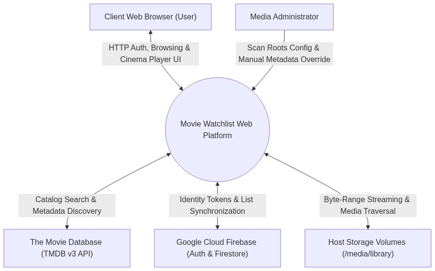
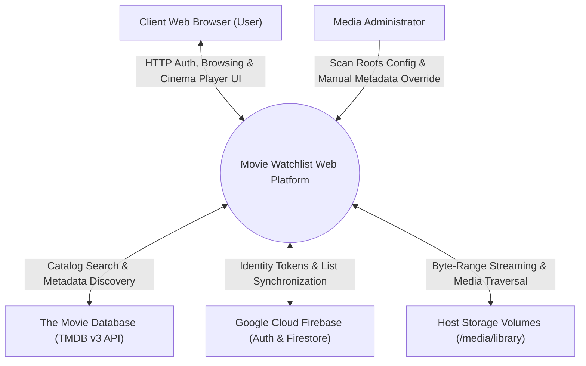
```mermaid
flowchart TD
    User["Client Web Browser (User)"]
    Admin["Media Administrator"]
    System(("Movie Watchlist Web Platform"))
    TMDB["The Movie Database (TMDB v3 API)"]
    Firebase["Google Cloud Firebase (Auth & Firestore)"]
    HostDisk["Host Storage Volumes (/media/library)"]

    User <-->|HTTP Auth, Browsing & Cinema Player UI| System
    Admin -->|Scan Roots Config & Manual Metadata Override| System
    System <-->|Catalog Search & Metadata Discovery| TMDB
    System <-->|Identity Tokens & List Synchronization| Firebase
    System <-->|Byte-Range Streaming & Media Traversal| HostDisk
```

### Figure 4.6.2: DFD Level 1 (Main Process Decomposition)

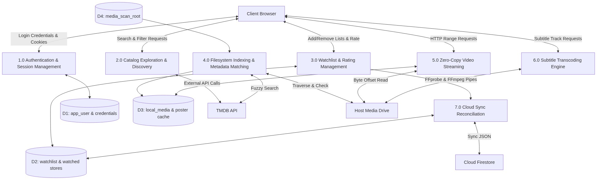
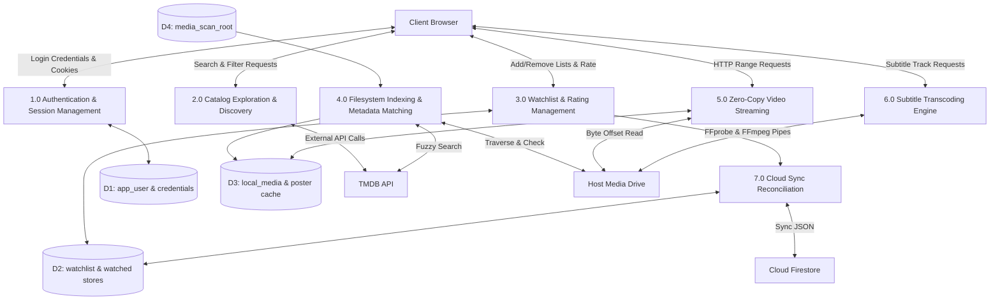
```mermaid
flowchart TD
    User["Client Browser"]
    
    P1["1.0 Authentication & Session Management"]
    P2["2.0 Catalog Exploration & Discovery"]
    P3["3.0 Watchlist & Rating Management"]
    P4["4.0 Filesystem Indexing & Metadata Matching"]
    P5["5.0 Zero-Copy Video Streaming"]
    P6["6.0 Subtitle Transcoding Engine"]
    P7["7.0 Cloud Sync Reconciliation"]

    D1[("D1: app_user & credentials")]
    D2[("D2: watchlist & watched stores")]
    D3[("D3: local_media & poster cache")]
    D4[("D4: media_scan_root")]
    
    TMDB["TMDB API"]
    Firestore["Cloud Firestore"]
    Disk["Host Media Drive"]

    User <-->|Login Credentials & Cookies| P1
    P1 <--> D1
    
    User <-->|Search & Filter Requests| P2
    P2 <-->|External API Calls| TMDB
    
    User <-->|Add/Remove Lists & Rate| P3
    P3 <--> D2
    P3 --> P7
    P7 <-->|Sync JSON| Firestore
    P7 <--> D2

    D4 --> P4
    P4 <-->|Traverse & Check| Disk
    P4 <-->|Fuzzy Search| TMDB
    P4 --> D3

    User <-->|HTTP Range Requests| P5
    P5 <-->|Byte Offset Read| Disk
    P5 <--> D3

    User <-->|Subtitle Track Requests| P6
    P6 <-->|FFprobe & FFmpeg Pipes| Disk
```

### Figure 4.6.3: DFD Level 2 (Critical Process Breakdown: Streaming & Subtitle Engine)

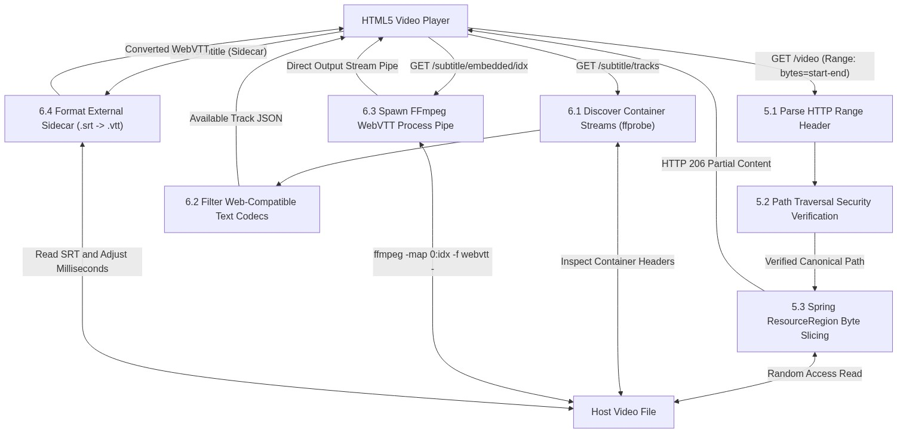
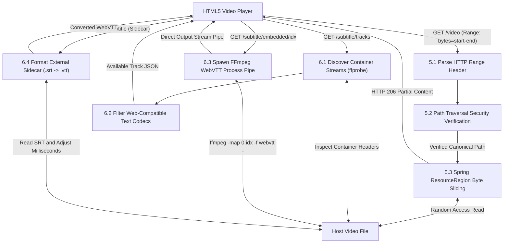
```mermaid
flowchart TD
    User["HTML5 Video Player"]
    
    P5_1["5.1 Parse HTTP Range Header"]
    P5_2["5.2 Path Traversal Security Verification"]
    P5_3["5.3 Spring ResourceRegion Byte Slicing"]
    
    P6_1["6.1 Discover Container Streams (ffprobe)"]
    P6_2["6.2 Filter Web-Compatible Text Codecs"]
    P6_3["6.3 Spawn FFmpeg WebVTT Process Pipe"]
    P6_4["6.4 Format External Sidecar (.srt -> .vtt)"]

    Disk["Host Video File"]

    User -->|"GET /video (Range: bytes=start-end)"| P5_1
    P5_1 --> P5_2
    P5_2 -->|Verified Canonical Path| P5_3
    P5_3 <-->|Random Access Read| Disk
    P5_3 -->|HTTP 206 Partial Content| User

    User -->|"GET /subtitle/tracks"| P6_1
    P6_1 <-->|Inspect Container Headers| Disk
    P6_1 --> P6_2
    P6_2 -->|Available Track JSON| User

    User -->|"GET /subtitle/embedded/idx"| P6_3
    P6_3 <-->|"ffmpeg -map 0:idx -f webvtt -"| Disk
    P6_3 -->|Direct Output Stream Pipe| User

    User -->|"GET /subtitle (Sidecar)"| P6_4
    P6_4 <-->|Read SRT and Adjust Milliseconds| Disk
    P6_4 -->|Converted WebVTT| User
```

---

## 4.7 Entity-Relationship Diagram (ERD) & Cloud Schema

### Figure 4.7.1: Entity-Relationship Diagram (ERD)

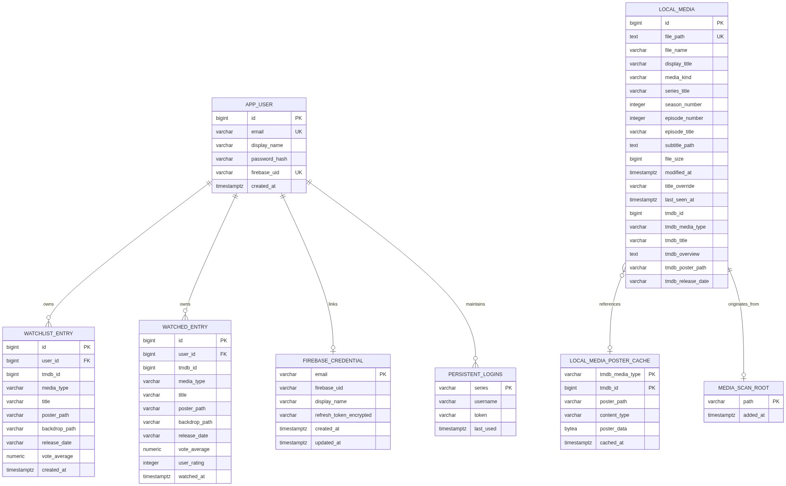
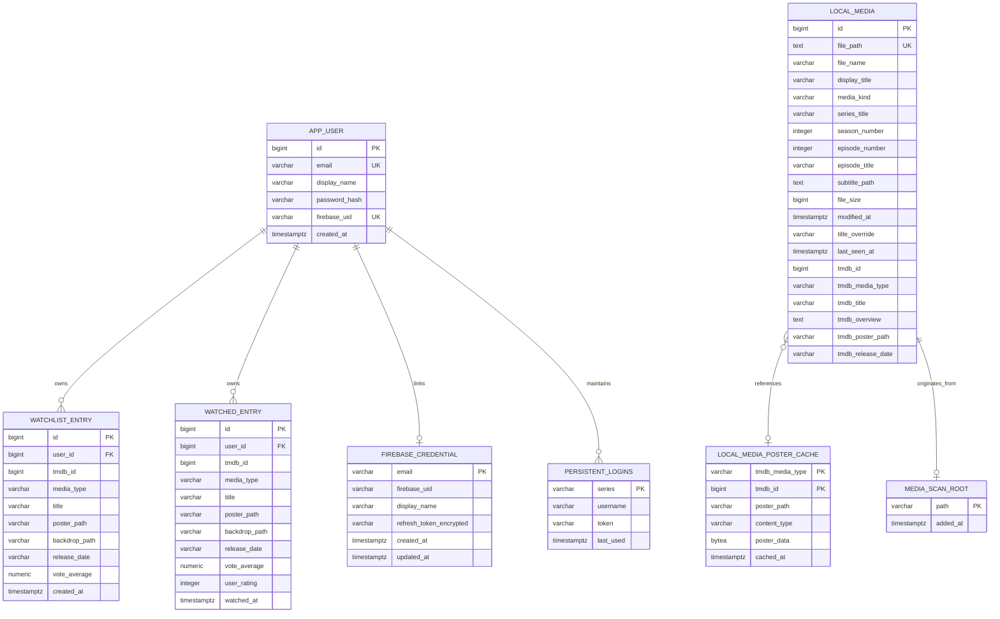
```mermaid
erDiagram
    APP_USER ||--o{ WATCHLIST_ENTRY : "owns"
    APP_USER ||--o{ WATCHED_ENTRY : "owns"
    APP_USER ||--o| FIREBASE_CREDENTIAL : "links"
    APP_USER ||--o{ PERSISTENT_LOGINS : "maintains"
    
    LOCAL_MEDIA }o--o| LOCAL_MEDIA_POSTER_CACHE : "references"
    LOCAL_MEDIA ||--o| MEDIA_SCAN_ROOT : "originates_from"

    APP_USER {
        bigint id PK
        varchar email UK
        varchar display_name
        varchar password_hash
        varchar firebase_uid UK
        timestamptz created_at
    }

    WATCHLIST_ENTRY {
        bigint id PK
        bigint user_id FK
        bigint tmdb_id
        varchar media_type
        varchar title
        varchar poster_path
        varchar backdrop_path
        varchar release_date
        numeric vote_average
        timestamptz created_at
    }

    WATCHED_ENTRY {
        bigint id PK
        bigint user_id FK
        bigint tmdb_id
        varchar media_type
        varchar title
        varchar poster_path
        varchar backdrop_path
        varchar release_date
        numeric vote_average
        integer user_rating
        timestamptz watched_at
    }

    LOCAL_MEDIA {
        bigint id PK
        text file_path UK
        varchar file_name
        varchar display_title
        varchar media_kind
        varchar series_title
        integer season_number
        integer episode_number
        varchar episode_title
        text subtitle_path
        bigint file_size
        timestamptz modified_at
        varchar title_override
        timestamptz last_seen_at
        bigint tmdb_id
        varchar tmdb_media_type
        varchar tmdb_title
        text tmdb_overview
        varchar tmdb_poster_path
        varchar tmdb_release_date
    }

    LOCAL_MEDIA_POSTER_CACHE {
        varchar tmdb_media_type PK
        bigint tmdb_id PK
        varchar poster_path
        varchar content_type
        bytea poster_data
        timestamptz cached_at
    }

    PERSISTENT_LOGINS {
        varchar series PK
        varchar username
        varchar token
        timestamptz last_used
    }

    FIREBASE_CREDENTIAL {
        varchar email PK
        varchar firebase_uid
        varchar display_name
        varchar refresh_token_encrypted
        timestamptz created_at
        timestamptz updated_at
    }

    MEDIA_SCAN_ROOT {
        varchar path PK
        timestamptz added_at
    }
```

---

## 4.8 User Interface Requirements
1. **Design System & Palette:** Cinema-grade dark theme (`#0f0f12` background) with high-contrast crimson/ruby accents (`#e50914`), muted light-gray metadata text (`#a3a3a3`), and off-white headers (`#f5f5f5`).
2. **Responsive Breakpoints:** 
   - Mobile: $360\text{px} - 767\text{px}$ (single-column cards, bottom mobile action drawer).
   - Tablet: $768\text{px} - 1023\text{px}$ (2–3 column shelf rails).
   - Desktop: $\ge 1024\text{px}$ (5–6 card carousel rails, full cinema player with floating overlays).
3. **Cinema Video Player UI:**
   - Full-bleed HTML5 video container.
   - Dynamic control bar fading after 3 seconds of cursor inactivity.
   - Seek bar with buffered progress indicators and hover time previews.
   - Modal dialog for dynamic subtitle track selection (listing external and embedded WebVTT streams).
   - End-of-video countdown modal prompting next episode auto-advance.

---

## 4.9 Logical Database Requirements

### 4.9.1 Detailed Data Dictionary & Schema Specification

#### Table 1: `app_user`
Stores unique user accounts for local authentication and links to federated cloud identities.
| Column Name | Data Type | Nullable | Default | Constraints & Keys | Business Rule / Description | Sample Value |
| :--- | :--- | :---: | :---: | :--- | :--- | :--- |
| `id` | `BIGINT` | No | Auto (Identity) | Primary Key | Unique system identifier for user. | `1001` |
| `email` | `VARCHAR(254)` | No | *None* | Unique Constraint | RFC 5322 valid user email address. | `user@example.com` |
| `display_name`| `VARCHAR(80)` | No | *None* | Check (>= 1 char) | User visible friendly name. | `Tsegahun M.` |
| `password_hash`| `VARCHAR(100)`| No | *None* | BCrypt Format | Salted password hash (cost factor 10). | `$2a$10$e7...` |
| `firebase_uid`| `VARCHAR(128)`| Yes | `NULL` | Unique Partial Index | Linked Firebase Auth UID (Flyway V6). | `W3eK8...` |
| `created_at` | `TIMESTAMPTZ` | No | `CURRENT_TIMESTAMP` | *None* | Account creation audit timestamp. | `2026-10-14 10:00:00+03` |

#### Table 2: `watchlist_entry`
Stores titles saved by users to watch in the future.
| Column Name | Data Type | Nullable | Default | Constraints & Keys | Business Rule / Description | Sample Value |
| :--- | :--- | :---: | :---: | :--- | :--- | :--- |
| `id` | `BIGINT` | No | Auto (Identity) | Primary Key | Unique watchlist entry identifier. | `501` |
| `user_id` | `BIGINT` | No | *None* | FK -> `app_user(id)` | Cascading delete on user deletion. | `1001` |
| `tmdb_id` | `BIGINT` | No | *None* | *None* | External TMDB media identifier. | `27205` |
| `media_type` | `VARCHAR(16)` | No | *None* | Check `('MOVIE', 'TV')` | Categorization discriminator. | `MOVIE` |
| `title` | `VARCHAR(300)` | No | *None* | *None* | Official catalog title. | `Inception` |
| `poster_path` | `VARCHAR(300)` | Yes | `NULL` | *None* | Relative path on TMDB CDN. | `/8IB2e...jpg` |
| `backdrop_path`| `VARCHAR(300)`| Yes | `NULL` | *None* | Relative backdrop image path. | `/s3T1v...jpg` |
| `release_date`| `VARCHAR(32)` | Yes | `NULL` | *None* | Release date in YYYY-MM-DD format. | `2010-07-16` |
| `vote_average`| `NUMERIC(4,2)`| Yes | `NULL` | *None* | TMDB public community score. | `8.36` |
| `created_at` | `TIMESTAMPTZ` | No | `CURRENT_TIMESTAMP` | Index `(user_id, created_at)` | Timestamp added to watchlist. | `2026-10-14 11:20:00+03` |
| *Composite* | *Unique Key* | No | *None* | `UNIQUE (user_id, tmdb_id, media_type)` | Prevents duplicate titles per user. | *N/A* |

#### Table 3: `watched_entry`
Stores completed viewing logs and user-assigned quality ratings.
| Column Name | Data Type | Nullable | Default | Constraints & Keys | Business Rule / Description | Sample Value |
| :--- | :--- | :---: | :---: | :--- | :--- | :--- |
| `id` | `BIGINT` | No | Auto (Identity) | Primary Key | Unique watched record identifier. | `801` |
| `user_id` | `BIGINT` | No | *None* | FK -> `app_user(id)` | Cascading delete on user deletion. | `1001` |
| `tmdb_id` | `BIGINT` | No | *None* | *None* | External TMDB media identifier. | `157336` |
| `media_type` | `VARCHAR(16)` | No | *None* | Check `('MOVIE', 'TV')` | Categorization discriminator. | `MOVIE` |
| `title` | `VARCHAR(300)` | No | *None* | *None* | Official catalog title. | `Interstellar` |
| `poster_path` | `VARCHAR(300)` | Yes | `NULL` | *None* | TMDB CDN poster path. | `/gEU2e...jpg` |
| `backdrop_path`| `VARCHAR(300)`| Yes | `NULL` | *None* | TMDB CDN backdrop path. | `/xJHb...jpg` |
| `release_date`| `VARCHAR(32)` | Yes | `NULL` | *None* | Release date string. | `2014-11-05` |
| `vote_average`| `NUMERIC(4,2)`| Yes | `NULL` | *None* | TMDB public score. | `8.44` |
| `user_rating` | `INTEGER` | Yes | `NULL` | Check `BETWEEN 1 AND 5` | User star rating (1 to 5 stars). | `5` |
| `watched_at` | `TIMESTAMPTZ` | No | `CURRENT_TIMESTAMP` | Index `(user_id, watched_at)` | Timestamp marked as watched. | `2026-10-14 12:00:00+03` |
| *Composite* | *Unique Key* | No | *None* | `UNIQUE (user_id, tmdb_id, media_type)` | Enforces single rating record per title. | *N/A* |

#### Table 4: `local_media`
Indexes physical video files discovered on host filesystem storage.
| Column Name | Data Type | Nullable | Default | Constraints & Keys | Business Rule / Description | Sample Value |
| :--- | :--- | :---: | :---: | :--- | :--- | :--- |
| `id` | `BIGINT` | No | Auto (Identity) | Primary Key | Unique local media identifier. | `15` |
| `file_path` | `TEXT` | No | *None* | Unique Constraint | Canonical absolute path on host disk. | `/media/library/Breaking Bad/S01E01.mkv` |
| `file_name` | `VARCHAR(600)`| No | *None* | *None* | File basename with extension. | `Breaking.Bad.S01E01.720p.mkv` |
| `display_title`| `VARCHAR(400)`| No | *None* | Index `(media_kind, display_title)` | Cleaned human-readable display title. | `Breaking Bad S01E01` |
| `media_kind` | `VARCHAR(16)` | No | *None* | Check `('MOVIE', 'EPISODE')` | Shelf discriminator. | `EPISODE` |
| `series_title` | `VARCHAR(300)`| Yes | `NULL` | Index `(series_title, season, ep)` | Parsed series name for TV shows. | `Breaking Bad` |
| `season_number`| `INTEGER` | Yes | `NULL` | *None* | Numerical season (0 for specials). | `1` |
| `episode_number`| `INTEGER` | Yes | `NULL` | *None* | Numerical episode index. | `1` |
| `episode_title`| `VARCHAR(300)`| Yes | `NULL` | *None* | Parsed episode name if present. | `Pilot` |
| `subtitle_path`| `TEXT` | Yes | `NULL` | *None* | Canonical path to matching `.srt`/`.vtt`.| `/media/library/Breaking Bad/S01E01.en.srt` |
| `file_size` | `BIGINT` | No | *None* | *None* | File size in bytes. | `1572864000` |
| `modified_at` | `TIMESTAMPTZ` | No | *None* | *None* | Filesystem modification time. | `2024-05-12 18:30:00+03` |
| `title_override`| `VARCHAR(400)`| Yes | `NULL` | *None* | User manual rename override. | `Pilot Episode` |
| `last_seen_at` | `TIMESTAMPTZ` | No | `CURRENT_TIMESTAMP` | *None* | Last verified during scan. | `2026-10-14 13:00:00+03` |
| `tmdb_id` | `BIGINT` | Yes | `NULL` | *None* | Matched TMDB show/movie ID. | `1396` |
| `tmdb_title` | `VARCHAR(300)`| Yes | `NULL` | *None* | Matched official title. | `Breaking Bad` |
| `tmdb_overview`| `TEXT` | Yes | `NULL` | *None* | Synopsis from TMDB. | `A high school chemistry teacher...` |
| `tmdb_poster_path`| `VARCHAR(300)`| Yes | `NULL` | *None* | Matched TMDB poster CDN path. | `/ztkSp...jpg` |

#### Table 5: `local_media_poster_cache`
Stores raw poster image bytes in PostgreSQL for fast, offline image serving.
| Column Name | Data Type | Nullable | Default | Constraints & Keys | Business Rule / Description | Sample Value |
| :--- | :--- | :---: | :---: | :--- | :--- | :--- |
| `tmdb_media_type`| `VARCHAR(16)`| No | *None* | Composite PK | Media type discriminator (`'MOVIE'`, `'TV'`). | `TV` |
| `tmdb_id` | `BIGINT` | No | *None* | Composite PK | TMDB identifier. | `1396` |
| `poster_path` | `VARCHAR(300)`| No | *None* | *None* | Remote TMDB poster relative path. | `/ztkSp...jpg` |
| `content_type` | `VARCHAR(100)`| No | *None* | *None* | Image MIME type. | `image/jpeg` |
| `poster_data` | `BYTEA` | No | *None* | *None* | Raw binary image bytes. | `\xffd8ffe000104a...` |
| `cached_at` | `TIMESTAMPTZ` | No | `CURRENT_TIMESTAMP` | *None* | Cache download timestamp. | `2026-10-14 13:05:00+03` |

#### Table 6: `persistent_logins`
Standard Spring Security remember-me token repository table.
| Column Name | Data Type | Nullable | Default | Constraints & Keys | Business Rule / Description | Sample Value |
| :--- | :--- | :---: | :---: | :--- | :--- | :--- |
| `series` | `VARCHAR(64)` | No | *None* | Primary Key | Unique session series identifier. | `k7Hs9Q...` |
| `username` | `VARCHAR(320)`| No | *None* | Index `username` | Authenticated user email. | `user@example.com` |
| `token` | `VARCHAR(64)` | No | *None* | *None* | Hashed session verification token. | `p9Ln2X...` |
| `last_used` | `TIMESTAMPTZ` | No | *None* | *None* | Timestamp of last auto-login. | `2026-10-14 13:10:00+03` |

#### Table 7: `firebase_credential`
Stores AES-GCM encrypted refresh tokens to maintain background cloud synchronization.
| Column Name | Data Type | Nullable | Default | Constraints & Keys | Business Rule / Description | Sample Value |
| :--- | :--- | :---: | :---: | :--- | :--- | :--- |
| `email` | `VARCHAR(254)`| No | *None* | Primary Key | User email address. | `user@example.com` |
| `firebase_uid` | `VARCHAR(128)`| No | *None* | *None* | Firebase Authentication UID. | `W3eK8...` |
| `display_name` | `VARCHAR(80)` | No | `''` | *None* | Cached user display name. | `Tsegahun M.` |
| `refresh_token_encrypted`| `VARCHAR(1024)`| No | *None* | *None* | AES-256-GCM encrypted token. | `IV:Ciphertext:AuthTag` |
| `created_at` | `TIMESTAMPTZ` | No | `CURRENT_TIMESTAMP` | *None* | Initial registration timestamp. | `2026-10-14 10:00:00+03` |
| `updated_at` | `TIMESTAMPTZ` | No | `CURRENT_TIMESTAMP` | *None* | Token refresh timestamp. | `2026-10-14 13:10:00+03` |

#### Table 8: `media_scan_root`
User-configurable filesystem directory roots monitored by the background scanner.
| Column Name | Data Type | Nullable | Default | Constraints & Keys | Business Rule / Description | Sample Value |
| :--- | :--- | :---: | :---: | :--- | :--- | :--- |
| `path` | `VARCHAR(1000)`| No | *None* | Primary Key | Canonical directory path on disk. | `/media/tsega/New Volume` |
| `added_at` | `TIMESTAMPTZ` | No | `CURRENT_TIMESTAMP` | *None* | Configuration timestamp. | `2026-10-14 09:30:00+03` |


### Table 4.1: Logical Database Table Definitions & Key Constraints
| Table Name | Primary Key | Foreign Keys & Target | Unique Constraints | Check Constraints |
| :--- | :--- | :--- | :--- | :--- |
| `app_user` | `id` (Identity) | *None* | `email`, `firebase_uid` | *None* |
| `watchlist_entry` | `id` (Identity) | `user_id` $\rightarrow$ `app_user(id)` | `(user_id, tmdb_id, media_type)` | `media_type IN ('MOVIE', 'TV')` |
| `watched_entry` | `id` (Identity) | `user_id` $\rightarrow$ `app_user(id)` | `(user_id, tmdb_id, media_type)` | `media_type IN ('MOVIE', 'TV')`<br>`user_rating BETWEEN 1 AND 5` |
| `local_media` | `id` (Identity) | *None* | `file_path` | `media_kind IN ('MOVIE', 'EPISODE')` |
| `local_media_poster_cache`| `(tmdb_media_type, tmdb_id)`| *None* | *None* | *None* |
| `persistent_logins` | `series` | *None* | *None* | *None* |
| `firebase_credential` | `email` | *None* | *None* | *None* |
| `media_scan_root` | `path` | *None* | *None* | *None* |

---

## 4.10 Quality Attributes (ISO/IEC 25010)
- **Security (ISO 25010: Security):** BCrypt password hashing ($10+$ rounds). AES-GCM-256 authenticated encryption for stored refresh tokens. Strict canonical path checking (`checkedPath`) preventing directory traversal outside approved roots.
- **Performance Efficiency (ISO 25010: Performance):** Direct zero-copy RFC 7233 range requests avoid server memory buffering. Embedded subtitle streams extracted directly to HTTP response pipelines. Poster images served with HTTP 304 private caching.
- **Reliability & Availability (ISO 25010: Reliability):** Dual-tier architecture allows full offline operation when internet is down. Database transactions guarantee ACID properties during sync.
- **Maintainability (ISO 25010: Maintainability):** Modular Spring packages. Flyway versioned migration scripts guarantee reproducible database environments across developer machines and Docker containers.

---

## 4.11 Requirements Traceability Matrix (RTM)

### 4.12 Detailed System Test Case Specifications

| Test Case ID | Test Category | Target Requirement | Preconditions | Test Input Data | Step-by-Step Execution Sequence | Expected Result | Pass/Fail Criteria |
| :---: | :---: | :---: | :--- | :--- | :--- | :--- | :--- |
| **TC-SEC-01** | Security / Auth | **FR01.1** | Clean database; unauthenticated session. | Email: `test@ddu.edu.et`<br>Pass: `SecretPass123!` | 1. Navigate to `/signup`<br>2. Submit valid registration form<br>3. Inspect database `app_user` row | User created; password stored as valid BCrypt hash (`$2a$10$...`); raw password nowhere in DB. | Pass if hash verifies with BCrypt. |
| **TC-SEC-02** | Security / Auth | **FR01.1** | Account `test@ddu.edu.et` already exists. | Email: `test@ddu.edu.et`<br>Pass: `DifferentPass!` | 1. Navigate to `/signup`<br>2. Re-submit form with identical email | System rejects submission; returns HTTP 409; displays duplicate email notification. | Pass if duplicate row is prevented. |
| **TC-SEC-03** | Security / Crypto | **FR01.3** | Account with Firebase sync active. | Valid Firebase refresh token | 1. Perform login with Remember-Me<br>2. Query `firebase_credential.refresh_token_encrypted`<br>3. Attempt decryption with `TokenCipher` | Stored string is formatted ciphertext; decrypted string matches original token. | Pass if plaintext is never stored. |
| **TC-SEC-04** | Security / Pathing | **NFR01** | Media roots set to `/media/library`. | Path: `../../../../etc/passwd` | 1. Execute GET `/library/video` with traversal payload<br>2. Inspect HTTP response code | System detects path escape in `checkedPath()`; throws SecurityException; returns HTTP 400/404. | Pass if zero bytes of unauthorized file leak. |
| **TC-CAT-01** | Functional / API | **FR02.1** | Valid `TMDB_API_KEY` configured. | GET `/` | 1. Navigate to home view `/`<br>2. Inspect carousel DOM elements | Page renders Trending Movies, Popular, Top Rated, and Upcoming rails with image cards. | Pass if cards display titles and poster paths. |
| **TC-CAT-02** | Functional / Search | **FR02.2** | Valid `TMDB_API_KEY` configured. | Query: `Matrix`<br>Genre: `28 (Action)`<br>Year: `1999` | 1. Navigate to `/search`<br>2. Enter query, select genre and year<br>3. Click Search | Results return "The Matrix" (1999); non-matching genres and years filtered out. | Pass if filtered results strictly match. |
| **TC-LIST-01** | Functional / List | **FR03.1** | Authenticated user session. | TMDB ID: `27205`<br>Media: `MOVIE` | 1. Click "Add to Watchlist" on Inception card<br>2. Inspect `watchlist_entry` table<br>3. Navigate to `/watchlist` | Record inserted with `user_id`, `tmdb_id=27205`; title card appears in `/watchlist` view. | Pass if entry persists across restarts. |
| **TC-LIST-02** | Functional / List | **FR03.2** | Title exists in watchlist. | Rating: `5 Stars` | 1. Click "Mark as Watched"<br>2. Select 5 stars<br>3. Submit | Record inserted in `watched_entry`; title automatically removed from `watchlist_entry`. | Pass if moved between lists atomically. |
| **TC-SCAN-01** | Filesystem / Regex | **FR05.1** | Media root contains `Show.S02E05.mkv`. | File scan triggered | 1. Click "Scan Now" in Settings<br>2. Query `local_media` table | `media_kind='EPISODE'`, `series_title='Show'`, `season_number=2`, `episode_number=5`. | Pass if regex extracts numbers correctly. |
| **TC-SCAN-02** | Filesystem / Exclusion| **FR05.1** | Folder `$RECYCLE.BIN` containing video. | File scan triggered | 1. Execute scan<br>2. Query `local_media` | Videos inside `$RECYCLE.BIN` are ignored and not inserted into database. | Pass if excluded folder is bypassed. |
| **TC-MATCH-01**| Functional / Match | **FR05.3** | Local file `Inception.2010.mkv` indexed. | Matcher execution | 1. Matcher executes search on TMDB<br>2. Computes Levenshtein score | Score >= 0.55; `tmdb_id=27205` attached; overview and poster path populated. | Pass if metadata correctly linked. |
| **TC-CACHE-01**| Storage / Cache | **FR05.4** | Matched local media with poster path. | Matcher execution | 1. System downloads poster bytes from CDN<br>2. Query `local_media_poster_cache` | Row exists with `BYTEA` data; GET `/library/posters/media/{id}` returns HTTP 200 `image/jpeg`. | Pass if image serves with network disabled. |
| **TC-STRM-01** | Streaming / RFC 7233 | **FR06.1** | Indexed 1GB video file `test.mp4`. | Header: `Range: bytes=0-1048575` | 1. Request video URL with byte-range header<br>2. Inspect response status and headers | Response returns HTTP 206 Partial Content; `Content-Range: bytes 0-1048575/1073741824`. | Pass if range chunk matches requested bytes. |
| **TC-STRM-02** | Streaming / Seeking | **FR06.1** | Video playing in browser. | Timeline seek to 45:00 | 1. Click timeline at 45:00<br>2. Monitor browser network panel | Browser issues new range request starting at target byte offset; video plays instantly without reload. | Pass if seek latency < 500ms. |
| **TC-SUB-01** | Subtitle / Sidecar | **FR06.2** | `movie.mkv` accompanied by `movie.en.srt`.| GET `/library/{id}/subtitle` | 1. Request subtitle endpoint<br>2. Inspect content body | Response MIME is `text/vtt;charset=UTF-8`; starts with `WEBVTT`; comma timecodes converted to dots. | Pass if valid WebVTT syntax returned. |
| **TC-SUB-02** | Subtitle / Embedded | **FR06.3** | `video.mkv` containing SubRip track 2. | GET `/library/{id}/subtitle/embedded/2`| 1. Request embedded stream<br>2. Inspect process list and stream output | `ffmpeg` subprocess spawned; WebVTT text streamed directly to client; process exits cleanly. | Pass if captions render synchronized in player. |
| **TC-PERF-01** | Performance / CPU | **NFR02** | Dual-core CPU host streaming 1080p MP4. | Active playback stream | 1. Start streaming video in browser<br>2. Measure host CPU usage with `top` | Host CPU utilization remains <= 2%; zero video transcoding threads created. | Pass if CPU load stays negligible. |
| **TC-PORT-01** | Portability / H2 | **NFR04** | PostgreSQL stopped; profile `portable`. | Run `./mvnw spring-boot:run -Pportable` | 1. Start application with portable profile<br>2. Access `http://localhost:8080` | App initializes embedded H2 database (`portable-schema.sql`); library scan and playback function. | Pass if app operates without external DB. |


### Table 4.2: Requirements Traceability Matrix (RTM)
| Req ID | Requirement Summary | Stakeholder | Use Case | Design & Model Artifact | Test Case ID |
| :---: | :--- | :---: | :---: | :--- | :---: |
| **FR01.1** | Local BCrypt Authentication | User | UC01 | Fig 4.4.1, `app_user` Table | `TC-SEC-01` |
| **FR01.2** | Firebase Identity Federation | User | UC01 | Fig 4.4.1, `FirebaseAuthenticationProvider` | `TC-SEC-02` |
| **FR01.3** | Persistent Remember-Me Session | User | UC01 | Fig 4.4.2, `persistent_logins`, `TokenCipher` | `TC-SEC-03` |
| **FR02.1** | TMDB Carousel Discovery | User | UC02 | Fig 4.4.3, `MovieCatalogService` | `TC-CAT-01` |
| **FR02.2** | Multi-Parametric Search | User | UC02 | Fig 4.4.3, `CatalogController` | `TC-CAT-02` |
| **FR03.1** | Personal Watchlist Persistence | User | UC03 | Fig 4.4.4, `watchlist_entry` Table | `TC-LIST-01`|
| **FR03.2** | Watched Rating Logging | User | UC03 | Fig 4.4.4, `watched_entry` Table | `TC-LIST-02`|
| **FR04.1** | Cloud Firestore Synchronization | User | UC06 | Fig 4.4.9, `FirebaseMediaSyncService` | `TC-SYNC-01`|
| **FR04.2** | Offline Fallback Resilience | Offline User | UC06 | Fig 4.1.1, PostgreSQL/H2 Dual Tier | `TC-SYNC-02`|
| **FR05.1** | Filesystem Traversal Indexing | Admin | UC07 | Fig 4.3.1, Fig 4.4.5, `MediaScanner` | `TC-SCAN-01`|
| **FR05.2** | Regex Hierarchy Parsing | Admin | UC07 | Fig 4.4.5, `local_media` Table | `TC-SCAN-02`|
| **FR05.3** | TMDB Fuzzy Matching ($\ge 0.55$) | Admin | UC08 | Fig 4.4.6, `LocalMediaTmdbMatcher` | `TC-SCAN-03`|
| **FR05.4** | Binary Poster Caching (BYTEA) | Admin | UC08 | Fig 4.4.6, `local_media_poster_cache` | `TC-SCAN-04`|
| **FR06.1** | HTTP 206 Byte-Range Streaming | User | UC04 | Fig 4.4.7, Fig 4.6.3, `ResourceRegion` | `TC-STRM-01`|
| **FR06.2** | Sidecar SRT to WebVTT Format | User | UC05 | Fig 4.3.2, Fig 4.6.3, `LibraryController` | `TC-SUB-01` |
| **FR06.3** | On-the-Fly FFmpeg WebVTT Pipe | User | UC05 | Fig 4.3.2, Fig 4.4.8, `EmbeddedSubtitleService` | `TC-SUB-02` |
| **FR06.4** | Timestamp Resume in localStorage | User | UC04 | Fig 4.2.1, Cinema Player JavaScript | `TC-STRM-02`|
| **FR07.1** | Configurable Media Scan Roots | Admin | UC07 | Fig 4.5.1, `media_scan_root` Table | `TC-ADM-01` |
| **NFR01** | Path Traversal Security | Maintainer | All | `checkedPath` Method, `NoStoreHtmlFilter` | `TC-SEC-04` |
| **NFR02** | CPU Utilization $\le 2\%$ | Viewer | UC04 | Zero-Copy Range Architecture | `TC-PERF-01`|
| **NFR04** | Portable H2 Database Profile | Offline User | All | `application-portable.properties` | `TC-PORT-01`|

---

# CHAPTER FIVE: CONCLUSION AND RECOMMENDATIONS

## 5.1 Conclusion
The **Movie Watchlist Web Platform** demonstrates that rich media tracking and high-definition local streaming do not require expensive multi-core servers or complex commercial software suites. By uniting modern Java/Spring Boot architectural patterns with RFC 7233 byte-range streaming, the system achieves:
1. **Hardware Efficiency:** CPU utilization remains negligible during 1080p video streaming, permitting deployment on modest personal computers.
2. **Seamless Subtitle Extraction:** The integration of FFmpeg and FFprobe subprocess pipes resolves the longstanding inability of HTML5 video players to consume embedded MKV subtitles without full video re-encoding.
3. **Data Sovereignty & Offline Resilience:** The dual-tier persistence design (PostgreSQL relational caching coupled with Cloud Firestore sync) ensures that personal watchlists, watched history, and movie posters remain accessible without internet connectivity.
4. **Rigorous Engineering Design:** Adhering strictly to IEEE 830, ISO/IEC 25010, and modern software requirements engineering practices established a traceable, verified, and maintainable software product.

## 5.2 Recommendations
1. **Hardware Acceleration for Image Extraction:** Future extensions should integrate FFmpeg video thumbnail generation to display interactive visual seek bars in the cinema player.
2. **Multi-User Permission Hierarchies:** Implement role-based parental controls to restrict local media categories (e.g., R-rated movies) based on user profile age settings.
3. **Audio Track Transmuxing:** For media files containing multi-channel TrueHD or DTS audio unsupported by standard web browsers, a lightweight AAC audio-only transmuxing pipeline should be incorporated without re-encoding the video track.
4. **Internationalization & Localization:** Introduce Amharic and regional language localizations for the user interface and TMDB overview translations.

---

# References
1. IEEE Computer Society, *IEEE Std 830-1998: IEEE Recommended Practice for Software Requirements Specifications*, IEEE, 1998.
2. ISO/IEC/IEEE, *ISO/IEC/IEEE 29148:2018 Systems and Software Engineering — Life Cycle Processes — Requirements Engineering*, IEEE, 2018.
3. Fielding, R., et al., *Hypertext Transfer Protocol (HTTP/1.1): Range Requests*, RFC 7233, Internet Engineering Task Force (IETF), 2014.
4. W3C, *WebVTT: The Web Video Text Tracks Format*, W3C Candidate Recommendation Draft, 2023.
5. Sommerville, I., *Software Engineering*, 10th ed., Pearson Education, 2016.
6. Pressman, R. S., and Maxim, B. R., *Software Engineering: A Practitioner’s Approach*, 8th ed., McGraw-Hill, 2015.
7. ISO/IEC, *ISO/IEC 25010:2011 Systems and Software Engineering — Systems and Software Quality Requirements and Evaluation (SQuaRE)*, ISO, 2011.
8. The Movie Database (TMDB), *TMDB API v3 Developer Documentation*, `https://developer.themoviedb.org/docs`.
9. Google Cloud, *Firebase Authentication and Cloud Firestore REST API Documentation*, Google, 2024.
